# BUỔI 4: THIẾT KẾ HỆ THỐNG – BIỂU ĐỒ LỚP & CƠ SỞ DỮ LIỆU

## Đề tài: Hệ thống Thương mại Điện tử (EcommerceWeb)

**Ngày thực hiện:** 23/03/2026

---

# PHẦN 1: BIỂU ĐỒ LỚP (CLASS DIAGRAM)

## 1.1. Tổng quan các lớp trong hệ thống

Hệ thống bao gồm **28 lớp thực thể** (Entity), **5 lớp nhúng** (Embeddable), **8 kiểu liệt kê** (Enum), và **1 lớp tài liệu Elasticsearch**, được tổ chức thành các module chức năng:

| STT | Module | Các lớp | Số lượng |
|:---:|--------|---------|:--------:|
| 1 | Người dùng (User) | User, UserAddress | 2 |
| 2 | Xác thực & Phân quyền (Auth) | Role, Permission, UserRole, RolePermission, UserIdentity | 5 |
| 3 | Sản phẩm (Product) | Product, Category, ProductVariant, ProductImage, ProductVariantImage, ProductAttribute, DetailAttribute, CustomerReview, Wishlist | 9 |
| 4 | Đơn hàng (Order) | Order, OrderShopGroup, OrderItem, ShippingAddress, ReturnRequest | 5 |
| 5 | Cửa hàng (Shop) | Shop, ShopFollower | 2 |
| 6 | Giỏ hàng (Cart) | CartItem | 1 |
| 7 | Khuyến mãi (Promotion) | Coupon, UserCoupon, CouponUsage | 3 |
| 8 | Kho hàng (Warehouse) | Warehouse, WarehouseStock, WarehouseEmployee | 3 |
| 9 | Nhắn tin (Chat) | Room, ChatMessage, RoomMember | 3 |
| 10 | Thông báo (Notification) | Notification | 1 |
| 11 | Quản trị (Admin) | ActivityLog, AuditLog, SearchHistory | 3 |

## 1.2. Biểu đồ lớp tổng quát

```mermaid
classDiagram
    direction TB

    %% ═══════════════════════════════════════════════
    %% LỚP CƠ SỞ (BASE)
    %% ═══════════════════════════════════════════════
    class BaseEntity {
        <<MappedSuperclass>>
        -LocalDateTime createdAt
        -LocalDateTime updatedAt
        -String createdBy
        -String updatedBy
        -Long version
        -LocalDateTime deletedAt
    }

    %% ═══════════════════════════════════════════════
    %% MODULE: NGƯỜI DÙNG (USER)
    %% ═══════════════════════════════════════════════
    class User {
        -String id
        -String username
        -String password
        -String email
        -String fullName
        -String phone
        -LocalDate dob
        -Boolean active
        -String profilePicture
        +getRoles() Set~Role~
    }

    class UserAddress {
        -String id
        -String receiverName
        -String phoneNumber
        -String fullAddress
        -String detailAddress
        -String ward
        -String wardCode
        -String district
        -Integer districtId
        -String province
        -Integer provinceId
        -Boolean defaultAddress
    }

    %% ═══════════════════════════════════════════════
    %% MODULE: XÁC THỰC & PHÂN QUYỀN (AUTH)
    %% ═══════════════════════════════════════════════
    class Role {
        -String id
        -String name
        -String description
        +getPermissions() Set~Permission~
    }

    class Permission {
        -String id
        -String name
        -String description
    }

    class UserRole {
        -UserRoleId id
        -Instant assignedAt
    }

    class RolePermission {
        -RolePermissionId id
    }

    class UserIdentity {
        -Long id
        -AuthProviderType provider
        -String providerUserId
        -String providerEmail
        -Instant linkedAt
    }

    class AuthProviderType {
        <<enumeration>>
        GOOGLE
        FACEBOOK
    }

    %% ═══════════════════════════════════════════════
    %% MODULE: SẢN PHẨM (PRODUCT)
    %% ═══════════════════════════════════════════════
    class Product {
        -String id
        -String name
        -String description
        -BigDecimal minPrice
        -BigDecimal maxPrice
        -Long totalSold
        -BigDecimal weight
        -BigDecimal length
        -BigDecimal width
        -BigDecimal height
    }

    class Category {
        -String id
        -String name
        -String description
        -String imageUrl
    }

    class ProductVariant {
        -String id
        -String name
        -String sku
        -BigDecimal price
        -Long stock
        -Long soldCount
        -String status
        -String imageUrl
        -BigDecimal weight
        -BigDecimal length
        -BigDecimal width
        -BigDecimal height
        +getMainImageUrl() String
    }

    class ProductImage {
        -String id
        -String url
        -Boolean isMain
    }

    class ProductVariantImage {
        -String id
        -String url
        -Boolean isMain
    }

    class ProductAttribute {
        -String id
        -String name
        -String status
        -Integer sortOrder
    }

    class DetailAttribute {
        -String id
        -String name
        -String imageUrl
        -String status
        -Integer sortOrder
    }

    class CustomerReview {
        -String id
        -Integer rating
        -String comment
    }

    class Wishlist {
        -String id
    }

    %% ═══════════════════════════════════════════════
    %% MODULE: ĐƠN HÀNG (ORDER)
    %% ═══════════════════════════════════════════════
    class Order {
        -String id
        -OrderStatus status
        -String cancelReason
        -BigDecimal total
        -BigDecimal subtotal
        -BigDecimal shippingFee
        -BigDecimal totalDiscount
        -String payment
        -String couponId
        -String couponCode
        -String shopCouponId
        -String shopCouponCode
        -BigDecimal discountAmount
        -BigDecimal shopDiscountAmount
        -BigDecimal shippingDiscountAmount
        -Boolean isPaid
        -String note
        +confirmReceipt()
        +changeStatus(OrderStatus target)
    }

    class OrderStatus {
        <<enumeration>>
        AWAITING_PAYMENT
        PENDING
        CONFIRMED
        SHIPPING
        DELIVERED
        COMPLETED
        CANCELLED
    }

    class OrderShopGroup {
        -String id
        -BigDecimal total
        -BigDecimal subtotal
        -BigDecimal shippingFee
        -BigDecimal totalDiscount
        -String shipment
    }

    class OrderItem {
        -String id
        -Integer quantity
        -BigDecimal price
        -String productId
        -String productName
        -String productImage
        -String variantName
        -String variantSku
    }

    class ShippingAddress {
        -String id
        -String receiverName
        -String phoneNumber
        -String fullAddress
        -String detailAddress
        -String ward
        -String wardCode
        -String district
        -Integer districtId
        -String province
        -String provinceId
    }

    class ReturnRequest {
        -String id
        -ReturnStatus status
        -ReturnReason reason
        -String description
        -String evidenceImages
        -BigDecimal refundAmount
        -String sellerResponse
        -LocalDateTime resolvedAt
    }

    class ReturnStatus {
        <<enumeration>>
        REQUESTED
        APPROVED
        REJECTED
        RETURNED
        REFUNDED
        CANCELLED
    }

    class ReturnReason {
        <<enumeration>>
        DEFECTIVE
        WRONG_ITEM
        NOT_AS_DESCRIBED
        DAMAGED_IN_SHIPPING
        CHANGED_MIND
        OTHER
    }

    %% ═══════════════════════════════════════════════
    %% MODULE: CỬA HÀNG (SHOP)
    %% ═══════════════════════════════════════════════
    class Shop {
        -String id
        -String name
        -String description
        -String logo
        -String address
        -String status
        -String rejectionReason
        -LocalDateTime approvedAt
        -ShopAddress shopAddress
    }

    class ShopAddress {
        <<Embeddable>>
        -String phoneNumber
        -BigDecimal latitude
        -BigDecimal longitude
        -String fullAddress
        -String detailAddress
        -String ward
        -String wardCode
        -String district
        -Integer districtId
        -String province
        -String provinceId
    }

    class ShopFollower {
        -String id
    }

    %% ═══════════════════════════════════════════════
    %% MODULE: GIỎ HÀNG (CART)
    %% ═══════════════════════════════════════════════
    class CartItem {
        -String id
        -Integer quantity
    }

    %% ═══════════════════════════════════════════════
    %% MODULE: KHUYẾN MÃI (PROMOTION)
    %% ═══════════════════════════════════════════════
    class Coupon {
        -String id
        -String code
        -CouponType couponType
        -DiscountType discountType
        -BigDecimal discountValue
        -BigDecimal maxDiscount
        -BigDecimal minOrderAmount
        -Integer maxUsage
        -Integer maxUsagePerUser
        -Integer currentUsage
        -LocalDateTime validFrom
        -LocalDateTime validTo
        -Boolean isActive
        -String description
        +isValid() boolean
        +calculateDiscount(BigDecimal) BigDecimal
    }

    class CouponType {
        <<enumeration>>
        PLATFORM
        SHOP
        PRODUCT
    }

    class DiscountType {
        <<enumeration>>
        PERCENTAGE
        FIXED_AMOUNT
        FREE_SHIPPING
    }

    class UserCoupon {
        -String id
        -String couponId
        -Boolean used
    }

    class CouponUsage {
        -String id
        -BigDecimal discountAmount
    }

    %% ═══════════════════════════════════════════════
    %% MODULE: KHO HÀNG (WAREHOUSE)
    %% ═══════════════════════════════════════════════
    class Warehouse {
        -String id
        -String name
        -String contactName
        -String contactPhone
        -String detailAddress
        -String fullAddress
        -String ward
        -String wardCode
        -String district
        -Integer districtId
        -String province
        -String provinceId
        -BigDecimal latitude
        -BigDecimal longitude
        -Integer ghnShopId
        -String status
        -Boolean isDefault
    }

    class WarehouseStock {
        -String id
        -Long stockQuantity
        -Long reservedQuantity
        +getAvailableQuantity() Long
        +hasAvailableStock(Long) boolean
        +reserve(Long)
        +releaseReservation(Long)
        +ship(Long)
    }

    class WarehouseEmployee {
        -String id
        -String role
    }

    %% ═══════════════════════════════════════════════
    %% MODULE: NHẮN TIN (CHAT)
    %% ═══════════════════════════════════════════════
    class Room {
        -String roomId
        -String name
        -String type
        -String privateKey
        -LocalDateTime lastMessageAt
    }

    class ChatMessage {
        -MessageId id
        -String content
        -String type
        -String senderName
    }

    class RoomMember {
        -RoomMemberId id
        -LocalDateTime lastReadAt
    }

    %% ═══════════════════════════════════════════════
    %% MODULE: THÔNG BÁO (NOTIFICATION)
    %% ═══════════════════════════════════════════════
    class Notification {
        -String id
        -String type
        -String title
        -String message
        -String status
        -LocalDateTime readAt
        -String referenceId
        -String referenceType
    }

    %% ═══════════════════════════════════════════════
    %% MODULE: QUẢN TRỊ (ADMIN)
    %% ═══════════════════════════════════════════════
    class ActivityLog {
        -String id
        -String action
        -String target
        -String userId
        -String details
        -String ipAddress
        -LocalDateTime createdAt
    }

    class AuditLog {
        -String id
        -String userId
        -String username
        -String action
        -String ipAddress
        -String userAgent
        -String details
        -LocalDateTime createdAt
    }

    class SearchHistory {
        -String id
        -String keyword
        -LocalDateTime searchedAt
    }

    %% ═══════════════════════════════════════════════
    %% QUAN HỆ KẾ THỪA (INHERITANCE)
    %% ═══════════════════════════════════════════════
    BaseEntity <|-- User
    BaseEntity <|-- UserAddress
    BaseEntity <|-- Role
    BaseEntity <|-- Permission
    BaseEntity <|-- UserRole
    BaseEntity <|-- RolePermission
    BaseEntity <|-- UserIdentity
    BaseEntity <|-- Product
    BaseEntity <|-- Category
    BaseEntity <|-- ProductVariant
    BaseEntity <|-- ProductImage
    BaseEntity <|-- ProductVariantImage
    BaseEntity <|-- ProductAttribute
    BaseEntity <|-- DetailAttribute
    BaseEntity <|-- CustomerReview
    BaseEntity <|-- Wishlist
    BaseEntity <|-- Order
    BaseEntity <|-- OrderShopGroup
    BaseEntity <|-- OrderItem
    BaseEntity <|-- ShippingAddress
    BaseEntity <|-- ReturnRequest
    BaseEntity <|-- Shop
    BaseEntity <|-- ShopFollower
    BaseEntity <|-- CartItem
    BaseEntity <|-- Coupon
    BaseEntity <|-- UserCoupon
    BaseEntity <|-- CouponUsage
    BaseEntity <|-- Warehouse
    BaseEntity <|-- WarehouseStock
    BaseEntity <|-- WarehouseEmployee
    BaseEntity <|-- Room
    BaseEntity <|-- Notification
    BaseEntity <|-- SearchHistory

    %% ═══════════════════════════════════════════════
    %% QUAN HỆ KẾT HỢP (ASSOCIATION)
    %% ═══════════════════════════════════════════════

    %% -- User relationships --
    User "1" --> "*" UserAddress : có nhiều >
    User "1" --> "*" UserRole : được gán >
    User "1" --> "*" UserIdentity : liên kết OAuth >
    User "1" --> "*" CartItem : có trong giỏ >
    User "1" --> "*" Order : đặt hàng >
    User "1" --> "*" Notification : nhận thông báo >
    User "1" --> "*" Wishlist : yêu thích >
    User "1" --> "*" UserCoupon : lưu coupon >
    User "1" --> "*" SearchHistory : lịch sử tìm kiếm >
    User "1" --> "*" CustomerReview : đánh giá >
    User "1" --> "*" ReturnRequest : yêu cầu trả hàng >
    User "1" --> "*" ShopFollower : theo dõi shop >

    %% -- Auth relationships --
    UserRole "*" --> "1" Role : thuộc vai trò >
    Role "1" --> "*" RolePermission : có quyền >
    RolePermission "*" --> "1" Permission : tham chiếu >
    UserIdentity --> AuthProviderType : dùng >

    %% -- Shop relationships --
    Shop "*" --> "1" User : thuộc sở hữu >
    Shop "*" --> "1" User : được duyệt bởi >
    Shop "1" *-- "1" ShopAddress : có địa chỉ >
    ShopFollower "*" --> "1" Shop : theo dõi >
    ShopFollower "*" --> "1" User : người theo dõi >

    %% -- Product relationships --
    Product "*" --> "1" Shop : thuộc shop >
    Product "*" --> "1" Category : thuộc danh mục >
    Product "1" --> "*" ProductImage : có ảnh >
    Product "1" --> "*" ProductVariant : có biến thể >
    Product "1" --> "*" ProductAttribute : có thuộc tính >
    ProductAttribute "1" --> "*" DetailAttribute : có chi tiết >
    ProductVariant "1" --> "*" ProductVariantImage : có ảnh >
    ProductVariant "*" <--> "*" DetailAttribute : liên kết thuộc tính
    Wishlist "*" --> "1" Product : sản phẩm yêu thích >

    %% -- Review & Cart --
    CustomerReview "*" --> "1" ProductVariant : đánh giá biến thể >
    CartItem "*" --> "1" ProductVariant : chọn biến thể >

    %% -- Order relationships --
    Order "1" --> "1" ShippingAddress : giao đến >
    Order "1" --> "*" OrderShopGroup : nhóm theo shop >
    OrderShopGroup "*" --> "1" Shop : thuộc shop >
    OrderShopGroup "*" --> "1" Warehouse : xuất từ kho >
    OrderShopGroup "1" --> "*" OrderItem : chứa sản phẩm >
    OrderItem "*" --> "1" ProductVariant : tham chiếu biến thể >
    OrderItem "1" --> "0..1" CustomerReview : có đánh giá >
    ReturnRequest "*" --> "1" Order : thuộc đơn hàng >
    ReturnRequest "*" --> "1" OrderItem : trả mặt hàng >

    %% -- Order enums --
    Order --> OrderStatus : trạng thái >
    ReturnRequest --> ReturnStatus : trạng thái trả >
    ReturnRequest --> ReturnReason : lý do trả >

    %% -- Coupon relationships --
    Coupon "*" --> "0..1" Shop : thuộc shop >
    Coupon --> CouponType : loại coupon >
    Coupon --> DiscountType : loại giảm giá >
    CouponUsage "*" --> "1" Coupon : sử dụng coupon >
    CouponUsage "*" --> "1" User : người dùng >
    CouponUsage "*" --> "1" Order : áp dụng cho đơn >

    %% -- Warehouse relationships --
    Warehouse "*" --> "1" Shop : thuộc shop >
    Warehouse "1" --> "*" WarehouseEmployee : có nhân viên >
    WarehouseEmployee "*" --> "1" User : là nhân viên >
    WarehouseStock "*" --> "1" Warehouse : trong kho >
    WarehouseStock "*" --> "1" ProductVariant : theo biến thể >

    %% -- Chat relationships --
    ChatMessage "*" --> "1" Room : trong phòng >
    ChatMessage "*" --> "1" User : gửi bởi >
    RoomMember "*" --> "1" Room : thuộc phòng >
    RoomMember "*" --> "1" User : thành viên >
```



## 1.3. Mô tả chi tiết các mối quan hệ

### A. Quan hệ Kế thừa (Inheritance)

Tất cả các entity (trừ ActivityLog, AuditLog, ChatMessage) đều kế thừa từ lớp trừu tượng `BaseEntity`, cung cấp các trường kiểm toán chung: `createdAt`, `updatedAt`, `createdBy`, `updatedBy`, `version` (Optimistic Locking), `deletedAt` (Soft Delete).

### B. Quan hệ Kết hợp (Association) – Tổng hợp

| STT | Quan hệ | Kiểu | Bội số | Mô tả |
|:---:|---------|------|:------:|-------|
| 1 | User ↔ UserAddress | OneToMany | 1:N | Một user có nhiều địa chỉ |
| 2 | User ↔ UserRole | OneToMany | 1:N | Một user được gán nhiều vai trò |
| 3 | UserRole ↔ Role | ManyToOne | N:1 | Nhiều phân công → 1 vai trò |
| 4 | Role ↔ RolePermission | OneToMany | 1:N | Một vai trò có nhiều quyền |
| 5 | RolePermission ↔ Permission | ManyToOne | N:1 | Nhiều gán quyền → 1 quyền |
| 6 | User ↔ UserIdentity | OneToMany | 1:N | Một user liên kết nhiều OAuth provider |
| 7 | User ↔ Shop | OneToMany | 1:N | Một user có thể sở hữu shop |
| 8 | Shop — ShopAddress | Embedded | 1:1 | Shop nhúng thông tin địa chỉ |
| 9 | User ↔ ShopFollower ↔ Shop | ManyToMany (qua bảng trung gian) | N:N | User theo dõi Shop |
| 10 | Product ↔ Shop | ManyToOne | N:1 | Nhiều SP thuộc 1 shop |
| 11 | Product ↔ Category | ManyToOne | N:1 | Nhiều SP thuộc 1 danh mục |
| 12 | Product ↔ ProductImage | OneToMany | 1:N | 1 SP có nhiều ảnh |
| 13 | Product ↔ ProductVariant | OneToMany | 1:N | 1 SP có nhiều biến thể |
| 14 | Product ↔ ProductAttribute | OneToMany | 1:N | 1 SP có nhiều thuộc tính |
| 15 | ProductAttribute ↔ DetailAttribute | OneToMany | 1:N | 1 thuộc tính có nhiều giá trị chi tiết |
| 16 | ProductVariant ↔ DetailAttribute | ManyToMany | N:N | Biến thể gồm nhiều giá trị thuộc tính |
| 17 | ProductVariant ↔ ProductVariantImage | OneToMany | 1:N | 1 biến thể có nhiều ảnh |
| 18 | ProductVariant ↔ CustomerReview | OneToMany | 1:N | 1 biến thể có nhiều đánh giá |
| 19 | User ↔ Wishlist ↔ Product | ManyToMany (qua bảng trung gian) | N:N | User yêu thích nhiều SP |
| 20 | User ↔ CartItem ↔ ProductVariant | ManyToMany (qua bảng trung gian) | N:N | User thêm biến thể vào giỏ |
| 21 | User ↔ Order | OneToMany | 1:N | 1 user có nhiều đơn hàng |
| 22 | Order ↔ ShippingAddress | OneToOne | 1:1 | 1 đơn hàng có 1 địa chỉ giao |
| 23 | Order ↔ OrderShopGroup | OneToMany | 1:N | 1 đơn nhóm theo shop |
| 24 | OrderShopGroup ↔ Shop | ManyToOne | N:1 | Nhóm hàng thuộc 1 shop |
| 25 | OrderShopGroup ↔ Warehouse | ManyToOne | N:1 | Nhóm hàng xuất từ 1 kho |
| 26 | OrderShopGroup ↔ OrderItem | OneToMany | 1:N | 1 nhóm có nhiều mặt hàng |
| 27 | OrderItem ↔ ProductVariant | ManyToOne | N:1 | Mặt hàng tham chiếu biến thể |
| 28 | OrderItem ↔ CustomerReview | OneToOne | 1:0..1 | Mặt hàng có thể có đánh giá |
| 29 | Order ↔ ReturnRequest | OneToMany | 1:N | 1 đơn có nhiều yêu cầu trả |
| 30 | Coupon ↔ Shop | ManyToOne | N:0..1 | Coupon thuộc shop hoặc platform |
| 31 | CouponUsage ↔ Coupon, User, Order | ManyToOne | N:1 mỗi cái | Theo dõi sử dụng coupon |
| 32 | Warehouse ↔ Shop | ManyToOne | N:1 | Nhiều kho thuộc 1 shop |
| 33 | Warehouse ↔ WarehouseEmployee | OneToMany | 1:N | 1 kho có nhiều NV |
| 34 | WarehouseEmployee ↔ User | ManyToOne | N:1 | NV kho là 1 user |
| 35 | WarehouseStock ↔ Warehouse, ProductVariant | ManyToOne | N:1 mỗi cái | Tồn kho theo kho + biến thể |
| 36 | Room ↔ ChatMessage | OneToMany | 1:N | 1 phòng có nhiều tin nhắn |
| 37 | Room ↔ RoomMember ↔ User | ManyToMany (qua bảng trung gian) | N:N | User tham gia phòng chat |
| 38 | ChatMessage ↔ User | ManyToOne | N:1 | Tin nhắn do user gửi |
| 39 | User ↔ Notification | OneToMany | 1:N | 1 user nhận nhiều thông báo |
| 40 | User ↔ SearchHistory | OneToMany | 1:N | 1 user có nhiều lịch sử tìm kiếm |

---

# PHẦN 2: THIẾT KẾ CƠ SỞ DỮ LIỆU (DATABASE DESIGN)

## 2.1. Tổng quan

- **Hệ quản trị CSDL:** MySQL 8.0
- **Connection Pool:** HikariCP (max 50 connections, min 10 idle)
- **Chiến lược ID:** UUID (VARCHAR(36)) cho hầu hết các bảng
- **Soft Delete:** Trường `deleted_at` trong tất cả bảng kế thừa BaseEntity
- **Optimistic Locking:** Trường `version` (BIGINT)
- **Audit Trail:** `created_at`, `updated_at`, `created_by`, `updated_by`

## 2.2. Chi tiết các bảng

> **Lưu ý:** Tất cả các bảng kế thừa từ BaseEntity đều có thêm các cột audit: `created_at` (DATETIME, NOT NULL), `updated_at` (DATETIME), `created_by` (VARCHAR(255)), `updated_by` (VARCHAR(255)), `version` (BIGINT, NOT NULL, DEFAULT 0), `deleted_at` (DATETIME). Các cột này không được lặp lại trong mỗi bảng bên dưới để tránh trùng lặp.

---

### 2.2.1. Bảng `users` – Người dùng

| Cột | Kiểu dữ liệu | Ràng buộc | Mô tả |
|-----|---------------|-----------|-------|
| id | VARCHAR(36) | PRIMARY KEY | Mã người dùng (UUID) |
| username | VARCHAR(50) | UNIQUE, NOT NULL | Tên đăng nhập |
| password | VARCHAR(255) | NOT NULL | Mật khẩu đã mã hóa (BCrypt) |
| email | VARCHAR(255) | UNIQUE, NOT NULL | Email đăng nhập |
| full_name | VARCHAR(255) | | Họ tên đầy đủ |
| phone | VARCHAR(20) | | Số điện thoại |
| dob | DATE | | Ngày sinh |
| active | BOOLEAN | NOT NULL, DEFAULT TRUE | Trạng thái tài khoản |
| profile_picture | VARCHAR(500) | | URL ảnh đại diện |

**Index:** `idx_username(username)`, `idx_email(email)`, `idx_active(active)`

---

### 2.2.2. Bảng `user_addresses` – Địa chỉ người dùng

| Cột | Kiểu dữ liệu | Ràng buộc | Mô tả |
|-----|---------------|-----------|-------|
| id | VARCHAR(36) | PRIMARY KEY | Mã địa chỉ (UUID) |
| user_id | VARCHAR(36) | FOREIGN KEY → users(id), NOT NULL | Mã người dùng |
| receiver_name | VARCHAR(255) | NOT NULL | Tên người nhận |
| phone_number | VARCHAR(20) | NOT NULL | SĐT người nhận |
| full_address | TEXT | | Địa chỉ đầy đủ |
| detail_address | TEXT | | Địa chỉ chi tiết (số nhà, đường) |
| ward | VARCHAR(100) | | Phường/Xã |
| ward_code | VARCHAR(20) | | Mã phường/xã (GHN) |
| district | VARCHAR(100) | | Quận/Huyện |
| district_id | INT | | Mã quận/huyện (GHN) |
| province | VARCHAR(100) | | Tỉnh/Thành phố |
| province_id | INT | | Mã tỉnh/thành phố (GHN) |
| default_address | BOOLEAN | NOT NULL, DEFAULT FALSE | Địa chỉ mặc định |

**Index:** `idx_user_id(user_id)`, `idx_default_address(default_address)`

---

### 2.2.3. Bảng `roles` – Vai trò

| Cột | Kiểu dữ liệu | Ràng buộc | Mô tả |
|-----|---------------|-----------|-------|
| id | VARCHAR(36) | PRIMARY KEY | Mã vai trò (UUID) |
| name | VARCHAR(100) | NOT NULL | Tên vai trò (ADMIN, SELLER, BUYER, WAREHOUSE_EMPLOYEE) |
| description | VARCHAR(500) | | Mô tả vai trò |

---

### 2.2.4. Bảng `permissions` – Quyền hạn

| Cột | Kiểu dữ liệu | Ràng buộc | Mô tả |
|-----|---------------|-----------|-------|
| id | VARCHAR(36) | PRIMARY KEY | Mã quyền (UUID) |
| name | VARCHAR(100) | NOT NULL | Tên quyền (vd: PRODUCT_CREATE, ORDER_VIEW) |
| description | VARCHAR(500) | | Mô tả quyền |

**Index:** `idx_permissions_module(name)`

---

### 2.2.5. Bảng `user_roles` – Gán vai trò cho người dùng

| Cột | Kiểu dữ liệu | Ràng buộc | Mô tả |
|-----|---------------|-----------|-------|
| user_id | VARCHAR(36) | PRIMARY KEY (composite), FOREIGN KEY → users(id) | Mã người dùng |
| role_id | VARCHAR(36) | PRIMARY KEY (composite), FOREIGN KEY → roles(id) | Mã vai trò |
| assigned_at | TIMESTAMP | | Thời điểm gán vai trò |

---

### 2.2.6. Bảng `role_permissions` – Gán quyền cho vai trò

| Cột | Kiểu dữ liệu | Ràng buộc | Mô tả |
|-----|---------------|-----------|-------|
| role_id | VARCHAR(36) | PRIMARY KEY (composite), FOREIGN KEY → roles(id) | Mã vai trò |
| permission_id | VARCHAR(36) | PRIMARY KEY (composite), FOREIGN KEY → permissions(id) | Mã quyền |

---

### 2.2.7. Bảng `user_identity` – Liên kết OAuth

| Cột | Kiểu dữ liệu | Ràng buộc | Mô tả |
|-----|---------------|-----------|-------|
| id | BIGINT | PRIMARY KEY, AUTO_INCREMENT | Mã liên kết |
| user_id | VARCHAR(36) | FOREIGN KEY → users(id), NOT NULL | Mã người dùng |
| provider | VARCHAR(20) | NOT NULL | Nhà cung cấp OAuth (GOOGLE, FACEBOOK) |
| provider_user_id | VARCHAR(255) | | ID user từ provider |
| provider_email | VARCHAR(255) | | Email từ provider |
| linked_at | TIMESTAMP | | Thời điểm liên kết |

**Unique:** `(provider, provider_user_id)`

---

### 2.2.8. Bảng `categories` – Danh mục sản phẩm

| Cột | Kiểu dữ liệu | Ràng buộc | Mô tả |
|-----|---------------|-----------|-------|
| id | VARCHAR(36) | PRIMARY KEY | Mã danh mục (UUID) |
| name | VARCHAR(100) | NOT NULL | Tên danh mục |
| description | TEXT | | Mô tả danh mục |
| image_url | VARCHAR(500) | | URL ảnh danh mục |

**Index:** `idx_categories_name(name)`

---

### 2.2.9. Bảng `products` – Sản phẩm

| Cột | Kiểu dữ liệu | Ràng buộc | Mô tả |
|-----|---------------|-----------|-------|
| id | VARCHAR(36) | PRIMARY KEY | Mã sản phẩm (UUID) |
| name | VARCHAR(200) | NOT NULL | Tên sản phẩm |
| description | TEXT | | Mô tả sản phẩm |
| min_price | DECIMAL(15,2) | NOT NULL | Giá thấp nhất (từ các variant) |
| max_price | DECIMAL(15,2) | NOT NULL | Giá cao nhất (từ các variant) |
| total_sold | BIGINT | NOT NULL, DEFAULT 0 | Tổng số lượng đã bán |
| weight | DECIMAL(10,2) | | Cân nặng (gram) |
| length | DECIMAL(10,2) | | Chiều dài (cm) |
| width | DECIMAL(10,2) | | Chiều rộng (cm) |
| height | DECIMAL(10,2) | | Chiều cao (cm) |
| shop_id | VARCHAR(36) | FOREIGN KEY → shops(id), NOT NULL | Mã shop sở hữu |
| category_id | VARCHAR(36) | FOREIGN KEY → categories(id) | Mã danh mục |

**Index:** `idx_products_shop_id(shop_id)`, `idx_products_category_id(category_id)`, `idx_product_min_price(min_price)`, `idx_product_total_sold(total_sold)`

---

### 2.2.10. Bảng `product_images` – Ảnh sản phẩm

| Cột | Kiểu dữ liệu | Ràng buộc | Mô tả |
|-----|---------------|-----------|-------|
| id | VARCHAR(36) | PRIMARY KEY | Mã ảnh (UUID) |
| product_id | VARCHAR(36) | FOREIGN KEY → products(id), NOT NULL | Mã sản phẩm |
| url | VARCHAR(500) | NOT NULL | URL ảnh (ImageKit CDN) |
| is_main | BOOLEAN | NOT NULL, DEFAULT FALSE | Ảnh chính hay không |

**Index:** `idx_product_images_product_id(product_id)`, `idx_product_images_product_main(product_id, is_main)`

---

### 2.2.11. Bảng `product_variants` – Biến thể sản phẩm

| Cột | Kiểu dữ liệu | Ràng buộc | Mô tả |
|-----|---------------|-----------|-------|
| id | VARCHAR(36) | PRIMARY KEY | Mã biến thể (UUID) |
| product_id | VARCHAR(36) | FOREIGN KEY → products(id), NOT NULL | Mã sản phẩm |
| name | VARCHAR(200) | | Tên biến thể (vd: "Đỏ - XL") |
| sku | VARCHAR(100) | | Mã SKU |
| price | DECIMAL(15,2) | NOT NULL | Giá bán |
| stock | BIGINT | | Tổng tồn kho |
| sold_count | BIGINT | NOT NULL, DEFAULT 0 | Số lượng đã bán |
| status | VARCHAR(20) | | Trạng thái (ACTIVE, INACTIVE) |
| image_url | VARCHAR(500) | | URL ảnh đại diện |
| weight | DECIMAL(10,2) | | Cân nặng (gram) |
| length | DECIMAL(10,2) | | Chiều dài (cm) |
| width | DECIMAL(10,2) | | Chiều rộng (cm) |
| height | DECIMAL(10,2) | | Chiều cao (cm) |

**Index:** `idx_product_variants_product_id(product_id)`, `idx_product_variants_status(status)`

---

### 2.2.12. Bảng `product_variant_images` – Ảnh biến thể

| Cột | Kiểu dữ liệu | Ràng buộc | Mô tả |
|-----|---------------|-----------|-------|
| id | VARCHAR(36) | PRIMARY KEY | Mã ảnh (UUID) |
| variant_id | VARCHAR(36) | FOREIGN KEY → product_variants(id), NOT NULL | Mã biến thể |
| url | VARCHAR(500) | NOT NULL | URL ảnh |
| is_main | BOOLEAN | NOT NULL, DEFAULT FALSE | Ảnh chính hay không |

**Index:** `idx_variant_images_variant_id(variant_id)`, `idx_variant_images_main(is_main)`

---

### 2.2.13. Bảng `product_attributes` – Thuộc tính sản phẩm

| Cột | Kiểu dữ liệu | Ràng buộc | Mô tả |
|-----|---------------|-----------|-------|
| id | VARCHAR(36) | PRIMARY KEY | Mã thuộc tính (UUID) |
| product_id | VARCHAR(36) | FOREIGN KEY → products(id), NOT NULL | Mã sản phẩm |
| name | VARCHAR(100) | NOT NULL | Tên thuộc tính (vd: "Màu sắc", "Kích thước") |
| status | VARCHAR(20) | | Trạng thái |
| sort_order | INT | NOT NULL, DEFAULT 0 | Thứ tự sắp xếp |

**Index:** `idx_product_attributes_product_id(product_id)`

---

### 2.2.14. Bảng `detail_attributes` – Giá trị chi tiết thuộc tính

| Cột | Kiểu dữ liệu | Ràng buộc | Mô tả |
|-----|---------------|-----------|-------|
| id | VARCHAR(36) | PRIMARY KEY | Mã giá trị thuộc tính (UUID) |
| product_attribute_id | VARCHAR(36) | FOREIGN KEY → product_attributes(id), NOT NULL | Mã thuộc tính cha |
| name | VARCHAR(100) | NOT NULL | Giá trị (vd: "Đỏ", "XL") |
| image_url | VARCHAR(500) | | URL ảnh minh hoạ |
| status | VARCHAR(20) | | Trạng thái |
| sort_order | INT | NOT NULL, DEFAULT 0 | Thứ tự sắp xếp |

**Index:** `idx_detail_attributes_product_attribute_id(product_attribute_id)`

---

### 2.2.15. Bảng `product_variant_detail_attributes` – Liên kết biến thể & thuộc tính (N:N)

| Cột | Kiểu dữ liệu | Ràng buộc | Mô tả |
|-----|---------------|-----------|-------|
| product_variant_id | VARCHAR(36) | PRIMARY KEY (composite), FOREIGN KEY → product_variants(id) | Mã biến thể |
| detail_attribute_id | VARCHAR(36) | PRIMARY KEY (composite), FOREIGN KEY → detail_attributes(id) | Mã giá trị thuộc tính |

---

### 2.2.16. Bảng `customer_reviews` – Đánh giá sản phẩm

| Cột | Kiểu dữ liệu | Ràng buộc | Mô tả |
|-----|---------------|-----------|-------|
| id | VARCHAR(36) | PRIMARY KEY | Mã đánh giá (UUID) |
| product_variant_id | VARCHAR(36) | FOREIGN KEY → product_variants(id), NOT NULL | Mã biến thể được đánh giá |
| user_id | VARCHAR(36) | FOREIGN KEY → users(id) | Mã người đánh giá |
| rating | INT | NOT NULL | Điểm đánh giá (1-5) |
| comment | TEXT | | Nội dung đánh giá |

**Index:** `idx_product_variant_id(product_variant_id)`, `idx_user_id(user_id)`, `idx_rating(rating)`, `idx_created_at(created_at)`

---

### 2.2.17. Bảng `wishlists` – Danh sách yêu thích

| Cột | Kiểu dữ liệu | Ràng buộc | Mô tả |
|-----|---------------|-----------|-------|
| id | VARCHAR(36) | PRIMARY KEY | Mã wishlist (UUID) |
| user_id | VARCHAR(36) | FOREIGN KEY → users(id), NOT NULL | Mã người dùng |
| product_id | VARCHAR(36) | FOREIGN KEY → products(id), NOT NULL | Mã sản phẩm |

**Unique:** `uk_user_product(user_id, product_id)` 
**Index:** `idx_user_id(user_id)`, `idx_product_id(product_id)`

---

### 2.2.18. Bảng `shops` – Cửa hàng

| Cột | Kiểu dữ liệu | Ràng buộc | Mô tả |
|-----|---------------|-----------|-------|
| id | VARCHAR(36) | PRIMARY KEY | Mã shop (UUID) |
| user_id | VARCHAR(36) | FOREIGN KEY → users(id), NOT NULL | Mã chủ shop |
| name | VARCHAR(100) | NOT NULL | Tên shop |
| description | TEXT | | Mô tả shop |
| logo | VARCHAR(500) | | URL logo shop |
| address | TEXT | | Địa chỉ hiển thị |
| status | VARCHAR(20) | NOT NULL | Trạng thái (PENDING, APPROVED, REJECTED, SUSPENDED) |
| rejection_reason | TEXT | | Lý do từ chối |
| approved_at | DATETIME | | Thời điểm phê duyệt |
| approved_by_id | VARCHAR(36) | FOREIGN KEY → users(id) | Admin phê duyệt |
| shop_address_phone_number | VARCHAR(20) | | SĐT shop |
| shop_address_latitude | DECIMAL(10,7) | | Vĩ độ |
| shop_address_longitude | DECIMAL(10,7) | | Kinh độ |
| shop_address_full_address | TEXT | | Địa chỉ đầy đủ |
| shop_address_detail_address | TEXT | | Địa chỉ chi tiết |
| shop_address_ward | VARCHAR(100) | | Phường/Xã |
| shop_address_ward_code | VARCHAR(20) | | Mã phường/xã |
| shop_address_district | VARCHAR(100) | | Quận/Huyện |
| shop_address_district_id | INT | | Mã quận/huyện |
| shop_address_province | VARCHAR(100) | | Tỉnh/Thành phố |
| shop_address_province_id | VARCHAR(10) | | Mã tỉnh/thành phố |

**Index:** `idx_shops_user_id(user_id)`, `idx_shops_status(status)`, `idx_shops_created_at(created_at)`

---

### 2.2.19. Bảng `shop_followers` – Theo dõi shop

| Cột | Kiểu dữ liệu | Ràng buộc | Mô tả |
|-----|---------------|-----------|-------|
| id | VARCHAR(36) | PRIMARY KEY | Mã follow (UUID) |
| user_id | VARCHAR(36) | FOREIGN KEY → users(id), NOT NULL | Mã người theo dõi |
| shop_id | VARCHAR(36) | FOREIGN KEY → shops(id), NOT NULL | Mã shop |

**Unique:** `uk_user_shop(user_id, shop_id)` 
**Index:** `idx_user_id(user_id)`, `idx_shop_id(shop_id)`

---

### 2.2.20. Bảng `carts` – Giỏ hàng

| Cột | Kiểu dữ liệu | Ràng buộc | Mô tả |
|-----|---------------|-----------|-------|
| id | VARCHAR(36) | PRIMARY KEY | Mã giỏ hàng (UUID) |
| user_id | VARCHAR(36) | FOREIGN KEY → users(id), NOT NULL | Mã người dùng |
| product_variant_id | VARCHAR(36) | FOREIGN KEY → product_variants(id), NOT NULL | Mã biến thể |
| quantity | INT | NOT NULL | Số lượng |

**Unique:** `uk_user_variant(user_id, product_variant_id)` 
**Index:** `idx_user_id(user_id)`, `idx_product_variant_id(product_variant_id)`, `idx_created_at(created_at)`

---

### 2.2.21. Bảng `orders` – Đơn hàng

| Cột | Kiểu dữ liệu | Ràng buộc | Mô tả |
|-----|---------------|-----------|-------|
| id | VARCHAR(36) | PRIMARY KEY | Mã đơn hàng (UUID) |
| user_id | VARCHAR(36) | FOREIGN KEY → users(id), NOT NULL | Mã người đặt |
| status | VARCHAR(20) | NOT NULL | Trạng thái đơn hàng (AWAITING_PAYMENT, PENDING, CONFIRMED, SHIPPING, DELIVERED, COMPLETED, CANCELLED) |
| cancel_reason | VARCHAR(255) | | Lý do huỷ đơn |
| total | DECIMAL(15,2) | | Tổng tiền thanh toán |
| subtotal | DECIMAL(15,2) | | Tổng tiền hàng (chưa phí ship, giảm giá) |
| shipping_fee | DECIMAL(15,2) | | Phí vận chuyển |
| total_discount | DECIMAL(15,2) | | Tổng giảm giá |
| payment | VARCHAR(20) | | Phương thức thanh toán (COD, VNPAY, MOMO, PAYPAL) |
| coupon_id | VARCHAR(36) | | Mã coupon platform |
| coupon_code | VARCHAR(50) | | Code coupon platform |
| shop_coupon_id | VARCHAR(36) | | Mã coupon shop |
| shop_coupon_code | VARCHAR(50) | | Code coupon shop |
| discount_amount | DECIMAL(15,2) | NOT NULL, DEFAULT 0 | Số tiền giảm (platform coupon) |
| shop_discount_amount | DECIMAL(15,2) | NOT NULL, DEFAULT 0 | Số tiền giảm (shop coupon) |
| shipping_discount_amount | DECIMAL(15,2) | NOT NULL, DEFAULT 0 | Số tiền giảm phí ship |
| is_paid | BOOLEAN | NOT NULL, DEFAULT FALSE | Đã thanh toán chưa |
| note | VARCHAR(500) | | Ghi chú đơn hàng |
| created_at | DATETIME | NOT NULL | Thời gian tạo đơn |
| updated_at | DATETIME | | Thời gian cập nhật |
| version | BIGINT | NOT NULL, DEFAULT 0 | Optimistic locking |

**Index:** `idx_orders_user_id(user_id)`, `idx_orders_status(status)`, `idx_orders_created_at(created_at)`, `idx_orders_payment(payment)`

---

### 2.2.22. Bảng `order_shop_groups` – Nhóm hàng theo shop trong đơn

| Cột | Kiểu dữ liệu | Ràng buộc | Mô tả |
|-----|---------------|-----------|-------|
| id | VARCHAR(36) | PRIMARY KEY | Mã nhóm (UUID) |
| order_id | VARCHAR(36) | FOREIGN KEY → orders(id), NOT NULL | Mã đơn hàng |
| shop_id | VARCHAR(36) | FOREIGN KEY → shops(id), NOT NULL | Mã shop |
| warehouse_id | VARCHAR(36) | FOREIGN KEY → warehouses(id) | Mã kho xuất hàng |
| total | DECIMAL(15,2) | | Tổng tiền nhóm |
| subtotal | DECIMAL(15,2) | | Tiền hàng nhóm |
| shipping_fee | DECIMAL(15,2) | | Phí ship nhóm |
| total_discount | DECIMAL(15,2) | | Giảm giá nhóm |
| shipment | VARCHAR(20) | | Loại vận chuyển (NORMAL, EXPRESS) |

**Index:** `idx_order_shop_groups_order_id(order_id)`, `idx_order_shop_groups_shop_id(shop_id)`, `idx_order_shop_groups_warehouse_id(warehouse_id)`

---

### 2.2.23. Bảng `order_items` – Mặt hàng trong đơn

| Cột | Kiểu dữ liệu | Ràng buộc | Mô tả |
|-----|---------------|-----------|-------|
| id | VARCHAR(36) | PRIMARY KEY | Mã mặt hàng (UUID) |
| order_shop_group_id | VARCHAR(36) | FOREIGN KEY → order_shop_groups(id), NOT NULL | Mã nhóm shop |
| product_variant_id | VARCHAR(36) | FOREIGN KEY → product_variants(id), NOT NULL | Mã biến thể |
| quantity | INT | NOT NULL | Số lượng mua |
| price | DECIMAL(15,2) | NOT NULL | Giá tại thời điểm mua |
| product_id | VARCHAR(36) | | Mã sản phẩm (snapshot) |
| product_name | VARCHAR(200) | | Tên sản phẩm (snapshot) |
| product_image | VARCHAR(500) | | Ảnh sản phẩm (snapshot) |
| variant_name | VARCHAR(200) | | Tên biến thể (snapshot) |
| variant_sku | VARCHAR(100) | | Mã SKU biến thể (snapshot) |
| customer_review_id | VARCHAR(36) | FOREIGN KEY → customer_reviews(id) | Mã đánh giá |

**Index:** `idx_order_items_group_id(order_shop_group_id)`, `idx_order_items_variant_id(product_variant_id)`, `idx_order_items_product_id(product_id)`

---

### 2.2.24. Bảng `shipping_addresses` – Địa chỉ giao hàng của đơn

| Cột | Kiểu dữ liệu | Ràng buộc | Mô tả |
|-----|---------------|-----------|-------|
| id | VARCHAR(36) | PRIMARY KEY | Mã địa chỉ (UUID) |
| order_id | VARCHAR(36) | FOREIGN KEY → orders(id), UNIQUE, NOT NULL | Mã đơn hàng (1:1) |
| receiver_name | VARCHAR(255) | NOT NULL | Tên người nhận |
| phone_number | VARCHAR(20) | NOT NULL | SĐT người nhận |
| full_address | TEXT | | Địa chỉ đầy đủ |
| detail_address | TEXT | | Địa chỉ chi tiết |
| ward | VARCHAR(100) | | Phường/Xã |
| ward_code | VARCHAR(20) | | Mã phường/xã |
| district | VARCHAR(100) | | Quận/Huyện |
| district_id | INT | | Mã quận/huyện |
| province | VARCHAR(100) | | Tỉnh/Thành phố |
| province_id | VARCHAR(10) | | Mã tỉnh/thành phố |

**Index:** `idx_shipping_order_id(order_id)`

---

### 2.2.25. Bảng `return_requests` – Yêu cầu trả hàng/hoàn tiền

| Cột | Kiểu dữ liệu | Ràng buộc | Mô tả |
|-----|---------------|-----------|-------|
| id | VARCHAR(36) | PRIMARY KEY | Mã yêu cầu trả hàng (UUID) |
| order_id | VARCHAR(36) | FOREIGN KEY → orders(id), NOT NULL | Mã đơn hàng |
| order_item_id | VARCHAR(36) | FOREIGN KEY → order_items(id), NOT NULL | Mã mặt hàng cần trả |
| user_id | VARCHAR(36) | FOREIGN KEY → users(id), NOT NULL | Mã người yêu cầu |
| status | VARCHAR(20) | NOT NULL, DEFAULT 'REQUESTED' | Trạng thái (REQUESTED, APPROVED, REJECTED, RETURNED, REFUNDED, CANCELLED) |
| reason | VARCHAR(30) | NOT NULL | Lý do trả (DEFECTIVE, WRONG_ITEM, NOT_AS_DESCRIBED, DAMAGED_IN_SHIPPING, CHANGED_MIND, OTHER) |
| description | TEXT | | Mô tả chi tiết |
| evidence_images | VARCHAR(2000) | | URL ảnh bằng chứng (JSON array) |
| refund_amount | DECIMAL(15,2) | | Số tiền hoàn trả |
| seller_response | TEXT | | Phản hồi từ seller |
| resolved_at | DATETIME | | Thời điểm xử lý xong |

**Index:** `idx_return_user(user_id)`, `idx_return_order(order_id)`, `idx_return_status(status)`

---

### 2.2.26. Bảng `coupons` – Mã giảm giá

| Cột | Kiểu dữ liệu | Ràng buộc | Mô tả |
|-----|---------------|-----------|-------|
| id | VARCHAR(36) | PRIMARY KEY | Mã coupon (UUID) |
| code | VARCHAR(50) | UNIQUE, NOT NULL | Code giảm giá |
| coupon_type | VARCHAR(20) | NOT NULL | Loại coupon (PLATFORM, SHOP, PRODUCT) |
| discount_type | VARCHAR(20) | NOT NULL | Loại giảm giá (PERCENTAGE, FIXED_AMOUNT, FREE_SHIPPING) |
| discount_value | DECIMAL(15,2) | | Giá trị giảm |
| max_discount | DECIMAL(15,2) | | Giảm tối đa |
| min_order_amount | DECIMAL(15,2) | | Đơn tối thiểu để áp dụng |
| max_usage | INT | | Số lần sử dụng tối đa |
| max_usage_per_user | INT | NOT NULL, DEFAULT 1 | Số lần / user |
| current_usage | INT | NOT NULL, DEFAULT 0 | Số lần đã dùng |
| valid_from | DATETIME | NOT NULL | Ngày bắt đầu hiệu lực |
| valid_to | DATETIME | NOT NULL | Ngày hết hiệu lực |
| is_active | BOOLEAN | NOT NULL, DEFAULT TRUE | Đang hoạt động |
| description | TEXT | | Mô tả coupon |
| shop_id | VARCHAR(36) | FOREIGN KEY → shops(id) | Shop sở hữu (NULL = platform coupon) |

**Index:** `idx_code(code)`, `idx_shop_id(shop_id)`, `idx_valid_period(valid_from, valid_to)`, `idx_is_active(is_active)`

---

### 2.2.27. Bảng `user_coupons` – Coupon đã lưu của user

| Cột | Kiểu dữ liệu | Ràng buộc | Mô tả |
|-----|---------------|-----------|-------|
| id | VARCHAR(36) | PRIMARY KEY | Mã (UUID) |
| user_id | VARCHAR(36) | FOREIGN KEY → users(id), NOT NULL | Mã người dùng |
| coupon_id | VARCHAR(36) | NOT NULL | Mã coupon đã lưu |
| used | BOOLEAN | NOT NULL, DEFAULT FALSE | Đã sử dụng hay chưa |

**Index:** `idx_user_coupons_user_id(user_id)`, `idx_user_coupons_coupon_id(coupon_id)`

---

### 2.2.28. Bảng `coupon_usages` – Lịch sử sử dụng coupon

| Cột | Kiểu dữ liệu | Ràng buộc | Mô tả |
|-----|---------------|-----------|-------|
| id | VARCHAR(36) | PRIMARY KEY | Mã (UUID) |
| coupon_id | VARCHAR(36) | FOREIGN KEY → coupons(id), NOT NULL | Mã coupon |
| user_id | VARCHAR(36) | FOREIGN KEY → users(id), NOT NULL | Mã người dùng |
| order_id | VARCHAR(36) | FOREIGN KEY → orders(id), NOT NULL | Mã đơn hàng |
| discount_amount | DECIMAL(15,2) | NOT NULL | Số tiền đã giảm |

---

### 2.2.29. Bảng `warehouses` – Kho hàng

| Cột | Kiểu dữ liệu | Ràng buộc | Mô tả |
|-----|---------------|-----------|-------|
| id | VARCHAR(36) | PRIMARY KEY | Mã kho (UUID) |
| shop_id | VARCHAR(36) | FOREIGN KEY → shops(id), NOT NULL | Mã shop sở hữu |
| name | VARCHAR(100) | NOT NULL | Tên kho |
| contact_name | VARCHAR(100) | | Tên LH kho |
| contact_phone | VARCHAR(20) | | SĐT LH kho |
| detail_address | TEXT | | Địa chỉ chi tiết |
| full_address | TEXT | | Địa chỉ đầy đủ |
| ward | VARCHAR(100) | | Phường/Xã |
| ward_code | VARCHAR(20) | | Mã phường/xã |
| district | VARCHAR(100) | | Quận/Huyện |
| district_id | INT | | Mã quận/huyện |
| province | VARCHAR(100) | | Tỉnh/Thành phố |
| province_id | VARCHAR(10) | | Mã tỉnh/thành phố |
| latitude | DECIMAL(10,7) | | Vĩ độ |
| longitude | DECIMAL(10,7) | | Kinh độ |
| ghn_shop_id | INT | | Mã shop GHN (điểm lấy hàng) |
| status | VARCHAR(20) | NOT NULL, DEFAULT 'ACTIVE' | Trạng thái (ACTIVE, INACTIVE) |
| is_default | BOOLEAN | NOT NULL, DEFAULT FALSE | Kho mặc định |

**Index:** `idx_warehouses_shop_id(shop_id)`, `idx_warehouses_status(status)`, `idx_warehouses_ghn_shop_id(ghn_shop_id)`

---

### 2.2.30. Bảng `warehouse_stock` – Tồn kho

| Cột | Kiểu dữ liệu | Ràng buộc | Mô tả |
|-----|---------------|-----------|-------|
| id | VARCHAR(36) | PRIMARY KEY | Mã tồn kho (UUID) |
| warehouse_id | VARCHAR(36) | FOREIGN KEY → warehouses(id), NOT NULL | Mã kho |
| product_variant_id | VARCHAR(36) | FOREIGN KEY → product_variants(id), NOT NULL | Mã biến thể |
| stock_quantity | BIGINT | NOT NULL, DEFAULT 0 | Số lượng tồn kho |
| reserved_quantity | BIGINT | NOT NULL, DEFAULT 0 | Số lượng đặt trước (đang xử lý đơn) |

**Unique:** `uk_warehouse_variant(warehouse_id, product_variant_id)` 
**Index:** `idx_warehouse_stock_warehouse(warehouse_id)`, `idx_warehouse_stock_variant(product_variant_id)`, `idx_warehouse_stock_deleted(deleted_at)`

---

### 2.2.31. Bảng `warehouse_employees` – Nhân viên kho

| Cột | Kiểu dữ liệu | Ràng buộc | Mô tả |
|-----|---------------|-----------|-------|
| id | VARCHAR(36) | PRIMARY KEY | Mã nhân viên kho (UUID) |
| warehouse_id | VARCHAR(36) | FOREIGN KEY → warehouses(id), NOT NULL | Mã kho |
| user_id | VARCHAR(36) | FOREIGN KEY → users(id), NOT NULL | Mã nhân viên |
| role | VARCHAR(50) | NOT NULL, DEFAULT 'EMPLOYEE' | Vai trò trong kho |

**Unique:** `uq_warehouse_employee(warehouse_id, user_id)` 
**Index:** `idx_wh_emp_warehouse_id(warehouse_id)`, `idx_wh_emp_user_id(user_id)`

---

### 2.2.32. Bảng `rooms` – Phòng chat

| Cột | Kiểu dữ liệu | Ràng buộc | Mô tả |
|-----|---------------|-----------|-------|
| room_id | VARCHAR(36) | PRIMARY KEY | Mã phòng (UUID) |
| name | VARCHAR(200) | | Tên phòng (cho group chat) |
| type | VARCHAR(20) | NOT NULL, DEFAULT 'PRIVATE' | Loại phòng (PRIVATE, GROUP) |
| private_key | VARCHAR(100) | UNIQUE | Khoá riêng (dùng cho chat 1-1) |
| last_message_at | DATETIME | | Thời điểm tin nhắn cuối |

**Index:** `idx_rooms_type(type)`, `idx_rooms_last_message_at(last_message_at)`, `idx_rooms_type_last_message(type, last_message_at)`

---

### 2.2.33. Bảng `messages` – Tin nhắn

| Cột | Kiểu dữ liệu | Ràng buộc | Mô tả |
|-----|---------------|-----------|-------|
| room_id | VARCHAR(36) | PRIMARY KEY (composite), FOREIGN KEY → rooms(room_id) | Mã phòng |
| sent_at | DATETIME | PRIMARY KEY (composite) | Thời điểm gửi |
| message_id | VARCHAR(36) | PRIMARY KEY (composite) | Mã tin nhắn (UUID) |
| sender_id | VARCHAR(36) | FOREIGN KEY → users(id) | Mã người gửi |
| sender_name | VARCHAR(100) | | Tên người gửi (snapshot) |
| content | TEXT | | Nội dung tin nhắn |
| type | VARCHAR(20) | | Loại tin (TEXT, IMAGE, SYSTEM) |

**Index:** `idx_sender(sender_id)`, `idx_sent_at(sent_at)`, `idx_room_sent(room_id, sent_at)`

---

### 2.2.34. Bảng `room_members` – Thành viên phòng chat

| Cột | Kiểu dữ liệu | Ràng buộc | Mô tả |
|-----|---------------|-----------|-------|
| room_id | VARCHAR(36) | PRIMARY KEY (composite), FOREIGN KEY → rooms(room_id) | Mã phòng |
| user_id | VARCHAR(36) | PRIMARY KEY (composite), FOREIGN KEY → users(id) | Mã thành viên |
| last_read_at | DATETIME | | Thời điểm đọc tin cuối |

**Index:** `idx_room_members_user(user_id)`, `idx_room_members_room(room_id)`

---

### 2.2.35. Bảng `notifications` – Thông báo

| Cột | Kiểu dữ liệu | Ràng buộc | Mô tả |
|-----|---------------|-----------|-------|
| id | VARCHAR(36) | PRIMARY KEY | Mã thông báo (UUID) |
| user_id | VARCHAR(36) | FOREIGN KEY → users(id), NOT NULL | Mã người nhận |
| type | VARCHAR(50) | NOT NULL | Loại thông báo (ORDER, PROMOTION, SYSTEM) |
| title | VARCHAR(200) | NOT NULL | Tiêu đề |
| message | TEXT | | Nội dung chi tiết |
| status | VARCHAR(20) | | Trạng thái (UNREAD, READ) |
| read_at | DATETIME | | Thời điểm đã đọc |
| reference_id | VARCHAR(36) | | ID tham chiếu (đơn hàng, coupon...) |
| reference_type | VARCHAR(30) | | Loại tham chiếu (ORDER, PRODUCT, COUPON) |

**Index:** `idx_user_id(user_id)`, `idx_status(status)`, `idx_type(type)`, `idx_created_at(created_at)`

---

### 2.2.36. Bảng `activity_logs` – Nhật ký hoạt động

| Cột | Kiểu dữ liệu | Ràng buộc | Mô tả |
|-----|---------------|-----------|-------|
| id | VARCHAR(36) | PRIMARY KEY | Mã log (UUID) |
| action | VARCHAR(100) | NOT NULL | Hành động (LOGIN, CREATE_PRODUCT, ...) |
| target | VARCHAR(100) | | Đối tượng tác động |
| user_id | VARCHAR(36) | | Mã người thực hiện |
| details | TEXT | | Chi tiết hành động (JSON) |
| ip_address | VARCHAR(50) | | Địa chỉ IP |
| created_at | DATETIME | NOT NULL | Thời gian ghi log |

**Index:** `idx_user_id(user_id)`, `idx_created_at(created_at)`, `idx_action(action)`

---

### 2.2.37. Bảng `audit_logs` – Nhật ký kiểm toán

| Cột | Kiểu dữ liệu | Ràng buộc | Mô tả |
|-----|---------------|-----------|-------|
| id | VARCHAR(36) | PRIMARY KEY | Mã audit (UUID) |
| user_id | VARCHAR(36) | | Mã người thực hiện |
| username | VARCHAR(50) | | Tên người thực hiện |
| action | VARCHAR(50) | NOT NULL | Hành động |
| ip_address | VARCHAR(45) | | Địa chỉ IP |
| user_agent | TEXT | | Thông tin trình duyệt |
| details | TEXT | | Chi tiết (JSON) |
| created_at | DATETIME | NOT NULL | Thời gian |

**Index:** `idx_audit_user_id(user_id)`, `idx_audit_action(action)`, `idx_audit_created(created_at)`

---

### 2.2.38. Bảng `search_history` – Lịch sử tìm kiếm

| Cột | Kiểu dữ liệu | Ràng buộc | Mô tả |
|-----|---------------|-----------|-------|
| id | VARCHAR(36) | PRIMARY KEY | Mã (UUID) |
| user_id | VARCHAR(36) | FOREIGN KEY → users(id), NOT NULL | Mã người dùng |
| keyword | VARCHAR(200) | NOT NULL | Từ khoá tìm kiếm |
| searched_at | DATETIME | NOT NULL | Thời điểm tìm kiếm |

**Index:** `idx_search_history_user(user_id)`, `idx_search_history_keyword(keyword)`

---

## 2.3. Sơ đồ quan hệ tổng hợp (ERD chi tiết)

```mermaid
erDiagram
    users ||--o{ user_addresses : "1:N"
    users ||--o{ user_roles : "1:N"
    users ||--o{ user_identity : "1:N"
    users ||--o{ orders : "1:N"
    users ||--o{ carts : "1:N"
    users ||--o{ wishlists : "1:N"
    users ||--o{ notifications : "1:N"
    users ||--o{ customer_reviews : "1:N"
    users ||--o{ return_requests : "1:N"
    users ||--o{ search_history : "1:N"
    users ||--o{ shop_followers : "1:N"
    users ||--o{ user_coupons : "1:N"
    users ||--o{ shops : "1:N"
    users ||--o{ warehouse_employees : "1:N"
    users ||--o{ room_members : "1:N"
    users ||--o{ messages : "1:N"

    roles ||--o{ user_roles : "1:N"
    roles ||--o{ role_permissions : "1:N"
    permissions ||--o{ role_permissions : "1:N"

    shops ||--o{ products : "1:N"
    shops ||--o{ warehouses : "1:N"
    shops ||--o{ coupons : "1:N"
    shops ||--o{ order_shop_groups : "1:N"
    shops ||--o{ shop_followers : "1:N"

    categories ||--o{ products : "1:N"

    products ||--o{ product_images : "1:N"
    products ||--o{ product_variants : "1:N"
    products ||--o{ product_attributes : "1:N"
    products ||--o{ wishlists : "1:N"

    product_attributes ||--o{ detail_attributes : "1:N"
    product_variants ||--o{ product_variant_images : "1:N"
    product_variants }o--o{ detail_attributes : "N:N"
    product_variants ||--o{ customer_reviews : "1:N"
    product_variants ||--o{ carts : "1:N"
    product_variants ||--o{ order_items : "1:N"
    product_variants ||--o{ warehouse_stock : "1:N"

    orders ||--|| shipping_addresses : "1:1"
    orders ||--o{ order_shop_groups : "1:N"
    orders ||--o{ return_requests : "1:N"
    orders ||--o{ coupon_usages : "1:N"

    order_shop_groups ||--o{ order_items : "1:N"
    order_shop_groups }o--|| warehouses : "N:1"

    order_items ||--o| customer_reviews : "1:0..1"
    order_items ||--o{ return_requests : "1:N"

    coupons ||--o{ coupon_usages : "1:N"

    warehouses ||--o{ warehouse_employees : "1:N"
    warehouses ||--o{ warehouse_stock : "1:N"

    rooms ||--o{ messages : "1:N"
    rooms ||--o{ room_members : "1:N"

    users {
        VARCHAR36 id PK
        VARCHAR50 username UK
        VARCHAR255 password
        VARCHAR255 email UK
        VARCHAR255 full_name
        VARCHAR20 phone
        DATE dob
        BOOLEAN active
        VARCHAR500 profile_picture
    }

    user_addresses {
        VARCHAR36 id PK
        VARCHAR36 user_id FK
        VARCHAR255 receiver_name
        VARCHAR20 phone_number
        TEXT full_address
        TEXT detail_address
        VARCHAR100 ward
        VARCHAR20 ward_code
        VARCHAR100 district
        INT district_id
        VARCHAR100 province
        INT province_id
        BOOLEAN default_address
    }

    roles {
        VARCHAR36 id PK
        VARCHAR100 name
        VARCHAR500 description
    }

    permissions {
        VARCHAR36 id PK
        VARCHAR100 name
        VARCHAR500 description
    }

    user_roles {
        VARCHAR36 user_id PK_FK
        VARCHAR36 role_id PK_FK
        TIMESTAMP assigned_at
    }

    role_permissions {
        VARCHAR36 role_id PK_FK
        VARCHAR36 permission_id PK_FK
    }

    user_identity {
        BIGINT id PK
        VARCHAR36 user_id FK
        VARCHAR20 provider
        VARCHAR255 provider_user_id
        VARCHAR255 provider_email
        TIMESTAMP linked_at
    }

    categories {
        VARCHAR36 id PK
        VARCHAR100 name
        TEXT description
        VARCHAR500 image_url
    }

    products {
        VARCHAR36 id PK
        VARCHAR200 name
        TEXT description
        DECIMAL15_2 min_price
        DECIMAL15_2 max_price
        BIGINT total_sold
        DECIMAL10_2 weight
        VARCHAR36 shop_id FK
        VARCHAR36 category_id FK
    }

    product_variants {
        VARCHAR36 id PK
        VARCHAR36 product_id FK
        VARCHAR200 name
        VARCHAR100 sku
        DECIMAL15_2 price
        BIGINT stock
        BIGINT sold_count
        VARCHAR20 status
        VARCHAR500 image_url
    }

    product_images {
        VARCHAR36 id PK
        VARCHAR36 product_id FK
        VARCHAR500 url
        BOOLEAN is_main
    }

    product_variant_images {
        VARCHAR36 id PK
        VARCHAR36 variant_id FK
        VARCHAR500 url
        BOOLEAN is_main
    }

    product_attributes {
        VARCHAR36 id PK
        VARCHAR36 product_id FK
        VARCHAR100 name
        VARCHAR20 status
        INT sort_order
    }

    detail_attributes {
        VARCHAR36 id PK
        VARCHAR36 product_attribute_id FK
        VARCHAR100 name
        VARCHAR500 image_url
        VARCHAR20 status
        INT sort_order
    }

    customer_reviews {
        VARCHAR36 id PK
        VARCHAR36 product_variant_id FK
        VARCHAR36 user_id FK
        INT rating
        TEXT comment
    }

    wishlists {
        VARCHAR36 id PK
        VARCHAR36 user_id FK
        VARCHAR36 product_id FK
    }

    shops {
        VARCHAR36 id PK
        VARCHAR36 user_id FK
        VARCHAR100 name
        TEXT description
        VARCHAR500 logo
        VARCHAR20 status
        DATETIME approved_at
        VARCHAR36 approved_by_id FK
    }

    shop_followers {
        VARCHAR36 id PK
        VARCHAR36 user_id FK
        VARCHAR36 shop_id FK
    }

    carts {
        VARCHAR36 id PK
        VARCHAR36 user_id FK
        VARCHAR36 product_variant_id FK
        INT quantity
    }

    orders {
        VARCHAR36 id PK
        VARCHAR36 user_id FK
        VARCHAR20 status
        DECIMAL15_2 total
        DECIMAL15_2 subtotal
        DECIMAL15_2 shipping_fee
        VARCHAR20 payment
        BOOLEAN is_paid
        VARCHAR500 note
    }

    order_shop_groups {
        VARCHAR36 id PK
        VARCHAR36 order_id FK
        VARCHAR36 shop_id FK
        VARCHAR36 warehouse_id FK
        DECIMAL15_2 total
        DECIMAL15_2 shipping_fee
        VARCHAR20 shipment
    }

    order_items {
        VARCHAR36 id PK
        VARCHAR36 order_shop_group_id FK
        VARCHAR36 product_variant_id FK
        INT quantity
        DECIMAL15_2 price
        VARCHAR200 product_name
        VARCHAR100 variant_sku
    }

    shipping_addresses {
        VARCHAR36 id PK
        VARCHAR36 order_id FK_UK
        VARCHAR255 receiver_name
        VARCHAR20 phone_number
        TEXT full_address
        VARCHAR100 district
        VARCHAR100 province
    }

    return_requests {
        VARCHAR36 id PK
        VARCHAR36 order_id FK
        VARCHAR36 order_item_id FK
        VARCHAR36 user_id FK
        VARCHAR20 status
        VARCHAR30 reason
        TEXT description
        DECIMAL15_2 refund_amount
    }

    coupons {
        VARCHAR36 id PK
        VARCHAR50 code UK
        VARCHAR20 coupon_type
        VARCHAR20 discount_type
        DECIMAL15_2 discount_value
        DECIMAL15_2 max_discount
        INT max_usage
        DATETIME valid_from
        DATETIME valid_to
        BOOLEAN is_active
        VARCHAR36 shop_id FK
    }

    user_coupons {
        VARCHAR36 id PK
        VARCHAR36 user_id FK
        VARCHAR36 coupon_id
        BOOLEAN used
    }

    coupon_usages {
        VARCHAR36 id PK
        VARCHAR36 coupon_id FK
        VARCHAR36 user_id FK
        VARCHAR36 order_id FK
        DECIMAL15_2 discount_amount
    }

    warehouses {
        VARCHAR36 id PK
        VARCHAR36 shop_id FK
        VARCHAR100 name
        TEXT full_address
        INT ghn_shop_id
        VARCHAR20 status
        BOOLEAN is_default
    }

    warehouse_stock {
        VARCHAR36 id PK
        VARCHAR36 warehouse_id FK
        VARCHAR36 product_variant_id FK
        BIGINT stock_quantity
        BIGINT reserved_quantity
    }

    warehouse_employees {
        VARCHAR36 id PK
        VARCHAR36 warehouse_id FK
        VARCHAR36 user_id FK
        VARCHAR50 role
    }

    rooms {
        VARCHAR36 room_id PK
        VARCHAR200 name
        VARCHAR20 type
        VARCHAR100 private_key UK
        DATETIME last_message_at
    }

    messages {
        VARCHAR36 room_id PK_FK
        DATETIME sent_at PK
        VARCHAR36 message_id PK
        VARCHAR36 sender_id FK
        VARCHAR100 sender_name
        TEXT content
        VARCHAR20 type
    }

    room_members {
        VARCHAR36 room_id PK_FK
        VARCHAR36 user_id PK_FK
        DATETIME last_read_at
    }

    notifications {
        VARCHAR36 id PK
        VARCHAR36 user_id FK
        VARCHAR50 type
        VARCHAR200 title
        TEXT message
        VARCHAR20 status
        DATETIME read_at
    }

    search_history {
        VARCHAR36 id PK
        VARCHAR36 user_id FK
        VARCHAR200 keyword
        DATETIME searched_at
    }
```

---

## 2.4. Thống kê tổng hợp CSDL

| Chỉ tiêu | Giá trị |
|-----------|---------|
| Tổng số bảng | 38 (gồm 1 bảng join N:N) |
| Bảng có khóa chính đơn (UUID) | 30 |
| Bảng có khóa chính tổ hợp | 5 (user_roles, role_permissions, messages, room_members, product_variant_detail_attributes) |
| Bảng có khóa chính AUTO_INCREMENT | 1 (user_identity) |
| Tổng số quan hệ khóa ngoại | 40+ |
| Ràng buộc UNIQUE | 10 |
| Bảng có Soft Delete (deleted_at) | 30 (tất cả kế thừa BaseEntity) |
| Bảng có Optimistic Locking (version) | 30 (tất cả kế thừa BaseEntity) + Order |
| Bảng có Audit Trail | 30 (created_at, updated_at, created_by, updated_by) |
| Enum được sử dụng | 8 (OrderStatus, ReturnStatus, ReturnReason, PaymentMethod, ShipmentType, DiscountType, CouponType, AuthProviderType) |

---

*Tài liệu được tạo dựa trên phân tích mã nguồn thực tế của hệ thống EcommerceWeb.*
