# Sequence Diagrams — EcommerceWeb

> Mỗi biểu đồ tuần tự (Sequence Diagram) dưới đây được vẽ theo chuẩn UML, phản ánh đúng luồng tương tác giữa **Tác nhân → Trình duyệt (Frontend) → Backend API (Controller → Service) → Cơ sở dữ liệu** và các dịch vụ bên ngoài (Elasticsearch, Redis, VNPay, GHN, ImageKit, WebSocket).

---

## UC01 — Tìm kiếm sản phẩm

**Tác nhân:** Người xem &nbsp;|&nbsp; **Mô tả:** Tìm kiếm sản phẩm theo từ khóa, danh mục, giá và bộ lọc.

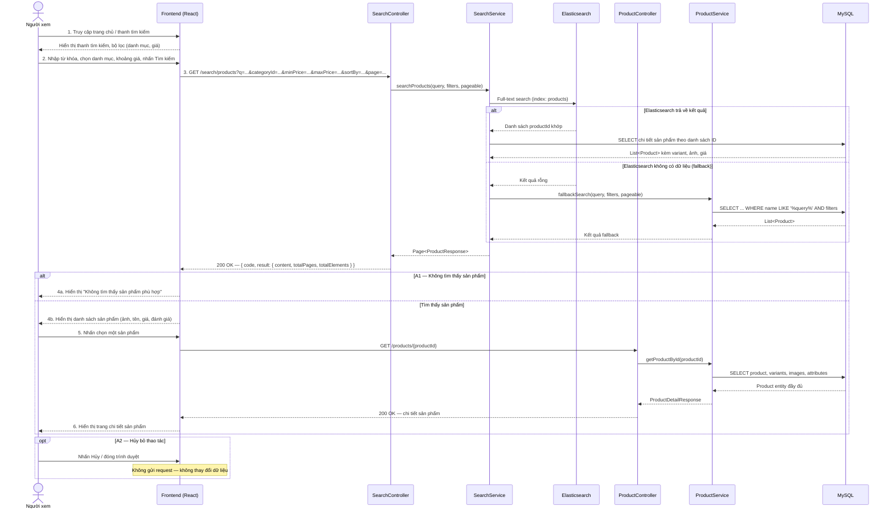
```mermaid
sequenceDiagram
    actor NguoiXem as Người xem
    participant FE as Frontend (React)
    participant SC as SearchController
    participant SS as SearchService
    participant ES as Elasticsearch
    participant PC as ProductController
    participant PS as ProductService
    participant DB as MySQL

    NguoiXem->>FE: 1. Truy cập trang chủ / thanh tìm kiếm
    FE-->>NguoiXem: Hiển thị thanh tìm kiếm, bộ lọc (danh mục, giá)

    NguoiXem->>FE: 2. Nhập từ khóa, chọn danh mục, khoảng giá, nhấn Tìm kiếm
    FE->>SC: 3. GET /search/products?q=...&categoryId=...&minPrice=...&maxPrice=...&sortBy=...&page=...
    SC->>SS: searchProducts(query, filters, pageable)
    SS->>ES: Full-text search (index: products)

    alt Elasticsearch trả về kết quả
        ES-->>SS: Danh sách productId khớp
        SS->>DB: SELECT chi tiết sản phẩm theo danh sách ID
        DB-->>SS: List<Product> kèm variant, ảnh, giá
    else Elasticsearch không có dữ liệu (fallback)
        ES-->>SS: Kết quả rỗng
        SS->>PS: fallbackSearch(query, filters, pageable)
        PS->>DB: SELECT ... WHERE name LIKE '%query%' AND filters
        DB-->>PS: List<Product>
        PS-->>SS: Kết quả fallback
    end

    SS-->>SC: Page<ProductResponse>
    SC-->>FE: 200 OK — { code, result: { content, totalPages, totalElements } }

    alt A1 — Không tìm thấy sản phẩm
        FE-->>NguoiXem: 4a. Hiển thị "Không tìm thấy sản phẩm phù hợp"
    else Tìm thấy sản phẩm
        FE-->>NguoiXem: 4b. Hiển thị danh sách sản phẩm (ảnh, tên, giá, đánh giá)
        NguoiXem->>FE: 5. Nhấn chọn một sản phẩm
        FE->>PC: GET /products/{productId}
        PC->>PS: getProductById(productId)
        PS->>DB: SELECT product, variants, images, attributes
        DB-->>PS: Product entity đầy đủ
        PS-->>PC: ProductDetailResponse
        PC-->>FE: 200 OK — chi tiết sản phẩm
        FE-->>NguoiXem: 6. Hiển thị trang chi tiết sản phẩm
    end

    opt A2 — Hủy bỏ thao tác
        NguoiXem->>FE: Nhấn Hủy / đóng trình duyệt
        Note over FE: Không gửi request — không thay đổi dữ liệu
    end
```

---

## UC02 — Quản lý giỏ hàng

**Tác nhân:** Người xem &nbsp;|&nbsp; **Mô tả:** Thêm, sửa số lượng hoặc xóa sản phẩm trong giỏ hàng.

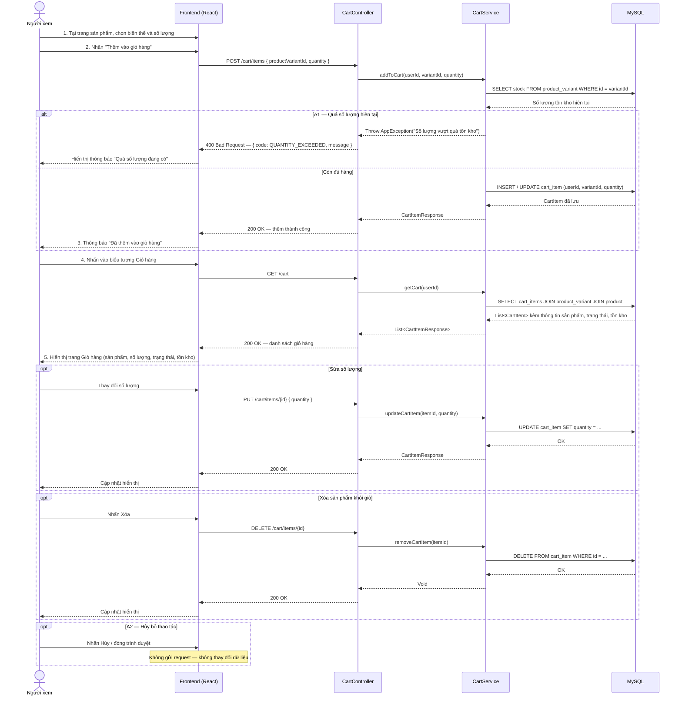
```mermaid
sequenceDiagram
    actor NguoiXem as Người xem
    participant FE as Frontend (React)
    participant CC as CartController
    participant CS as CartService
    participant DB as MySQL

    NguoiXem->>FE: 1. Tại trang sản phẩm, chọn biến thể và số lượng
    NguoiXem->>FE: 2. Nhấn "Thêm vào giỏ hàng"
    FE->>CC: POST /cart/items { productVariantId, quantity }
    CC->>CS: addToCart(userId, variantId, quantity)
    CS->>DB: SELECT stock FROM product_variant WHERE id = variantId
    DB-->>CS: Số lượng tồn kho hiện tại

    alt A1 — Quá số lượng hiện tại
        CS-->>CC: Throw AppException("Số lượng vượt quá tồn kho")
        CC-->>FE: 400 Bad Request — { code: QUANTITY_EXCEEDED, message }
        FE-->>NguoiXem: Hiển thị thông báo "Quá số lượng đang có"
    else Còn đủ hàng
        CS->>DB: INSERT / UPDATE cart_item (userId, variantId, quantity)
        DB-->>CS: CartItem đã lưu
        CS-->>CC: CartItemResponse
        CC-->>FE: 200 OK — thêm thành công
        FE-->>NguoiXem: 3. Thông báo "Đã thêm vào giỏ hàng"
    end

    NguoiXem->>FE: 4. Nhấn vào biểu tượng Giỏ hàng
    FE->>CC: GET /cart
    CC->>CS: getCart(userId)
    CS->>DB: SELECT cart_items JOIN product_variant JOIN product
    DB-->>CS: List<CartItem> kèm thông tin sản phẩm, trạng thái, tồn kho
    CS-->>CC: List<CartItemResponse>
    CC-->>FE: 200 OK — danh sách giỏ hàng
    FE-->>NguoiXem: 5. Hiển thị trang Giỏ hàng (sản phẩm, số lượng, trạng thái, tồn kho)

    opt Sửa số lượng
        NguoiXem->>FE: Thay đổi số lượng
        FE->>CC: PUT /cart/items/{id} { quantity }
        CC->>CS: updateCartItem(itemId, quantity)
        CS->>DB: UPDATE cart_item SET quantity = ...
        DB-->>CS: OK
        CS-->>CC: CartItemResponse
        CC-->>FE: 200 OK
        FE-->>NguoiXem: Cập nhật hiển thị
    end

    opt Xóa sản phẩm khỏi giỏ
        NguoiXem->>FE: Nhấn Xóa
        FE->>CC: DELETE /cart/items/{id}
        CC->>CS: removeCartItem(itemId)
        CS->>DB: DELETE FROM cart_item WHERE id = ...
        DB-->>CS: OK
        CS-->>CC: Void
        CC-->>FE: 200 OK
        FE-->>NguoiXem: Cập nhật hiển thị
    end

    opt A2 — Hủy bỏ thao tác
        NguoiXem->>FE: Nhấn Hủy / đóng trình duyệt
        Note over FE: Không gửi request — không thay đổi dữ liệu
    end
```

---

## UC03 — Đăng ký tài khoản

**Tác nhân:** Khách hàng &nbsp;|&nbsp; **Mô tả:** Người dùng mới tạo tài khoản trên hệ thống.

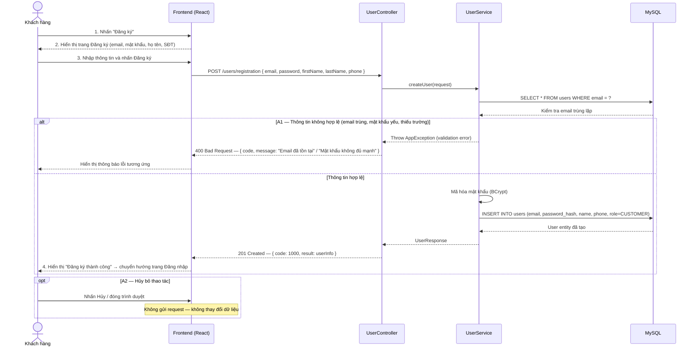
```mermaid
sequenceDiagram
    actor KH as Khách hàng
    participant FE as Frontend (React)
    participant UC as UserController
    participant US as UserService
    participant DB as MySQL

    KH->>FE: 1. Nhấn "Đăng ký"
    FE-->>KH: 2. Hiển thị trang Đăng ký (email, mật khẩu, họ tên, SĐT)
    KH->>FE: 3. Nhập thông tin và nhấn Đăng ký
    FE->>UC: POST /users/registration { email, password, firstName, lastName, phone }
    UC->>US: createUser(request)
    US->>DB: SELECT * FROM users WHERE email = ?
    DB-->>US: Kiểm tra email trùng lặp

    alt A1 — Thông tin không hợp lệ (email trùng, mật khẩu yếu, thiếu trường)
        US-->>UC: Throw AppException (validation error)
        UC-->>FE: 400 Bad Request — { code, message: "Email đã tồn tại" / "Mật khẩu không đủ mạnh" }
        FE-->>KH: Hiển thị thông báo lỗi tương ứng
    else Thông tin hợp lệ
        US->>US: Mã hóa mật khẩu (BCrypt)
        US->>DB: INSERT INTO users (email, password_hash, name, phone, role=CUSTOMER)
        DB-->>US: User entity đã tạo
        US-->>UC: UserResponse
        UC-->>FE: 201 Created — { code: 1000, result: userInfo }
        FE-->>KH: 4. Hiển thị "Đăng ký thành công" → chuyển hướng trang Đăng nhập
    end

    opt A2 — Hủy bỏ thao tác
        KH->>FE: Nhấn Hủy / đóng trình duyệt
        Note over FE: Không gửi request — không thay đổi dữ liệu
    end
```

---

## UC04 — Quản lý thông tin cá nhân

**Tác nhân:** Khách hàng &nbsp;|&nbsp; **Mô tả:** Cập nhật thông tin cá nhân và quản lý địa chỉ giao hàng.

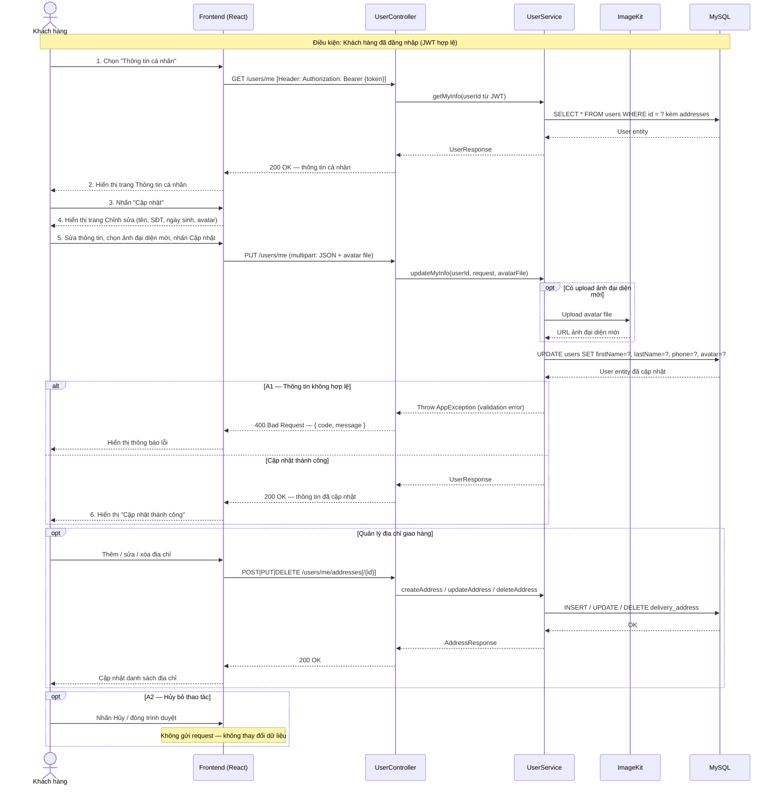
```mermaid
sequenceDiagram
    actor KH as Khách hàng
    participant FE as Frontend (React)
    participant UC as UserController
    participant US as UserService
    participant IK as ImageKit
    participant DB as MySQL

    Note over KH,DB: Điều kiện: Khách hàng đã đăng nhập (JWT hợp lệ)

    KH->>FE: 1. Chọn "Thông tin cá nhân"
    FE->>UC: GET /users/me [Header: Authorization: Bearer {token}]
    UC->>US: getMyInfo(userId từ JWT)
    US->>DB: SELECT * FROM users WHERE id = ? kèm addresses
    DB-->>US: User entity
    US-->>UC: UserResponse
    UC-->>FE: 200 OK — thông tin cá nhân
    FE-->>KH: 2. Hiển thị trang Thông tin cá nhân

    KH->>FE: 3. Nhấn "Cập nhật"
    FE-->>KH: 4. Hiển thị trang Chỉnh sửa (tên, SĐT, ngày sinh, avatar)
    KH->>FE: 5. Sửa thông tin, chọn ảnh đại diện mới, nhấn Cập nhật
    FE->>UC: PUT /users/me (multipart: JSON + avatar file)
    UC->>US: updateMyInfo(userId, request, avatarFile)

    opt Có upload ảnh đại diện mới
        US->>IK: Upload avatar file
        IK-->>US: URL ảnh đại diện mới
    end

    US->>DB: UPDATE users SET firstName=?, lastName=?, phone=?, avatar=?
    DB-->>US: User entity đã cập nhật

    alt A1 — Thông tin không hợp lệ
        US-->>UC: Throw AppException (validation error)
        UC-->>FE: 400 Bad Request — { code, message }
        FE-->>KH: Hiển thị thông báo lỗi
    else Cập nhật thành công
        US-->>UC: UserResponse
        UC-->>FE: 200 OK — thông tin đã cập nhật
        FE-->>KH: 6. Hiển thị "Cập nhật thành công"
    end

    opt Quản lý địa chỉ giao hàng
        KH->>FE: Thêm / sửa / xóa địa chỉ
        FE->>UC: POST|PUT|DELETE /users/me/addresses[/{id}]
        UC->>US: createAddress / updateAddress / deleteAddress
        US->>DB: INSERT / UPDATE / DELETE delivery_address
        DB-->>US: OK
        US-->>UC: AddressResponse
        UC-->>FE: 200 OK
        FE-->>KH: Cập nhật danh sách địa chỉ
    end

    opt A2 — Hủy bỏ thao tác
        KH->>FE: Nhấn Hủy / đóng trình duyệt
        Note over FE: Không gửi request — không thay đổi dữ liệu
    end
```

---

## UC05 — Đặt hàng

**Tác nhân:** Khách hàng &nbsp;|&nbsp; **Mô tả:** Tạo đơn hàng, chọn địa chỉ, chi phí và xác nhận mua.

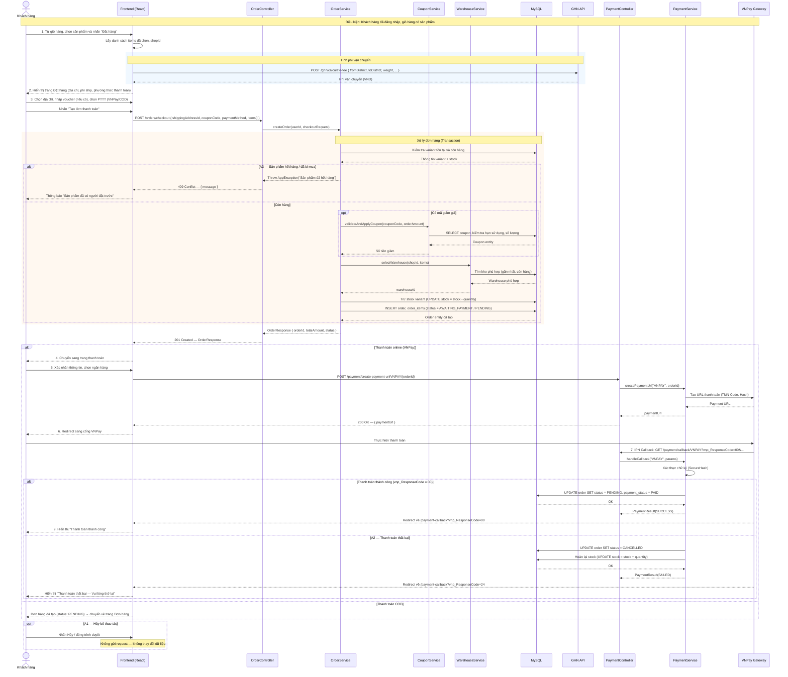
```mermaid
sequenceDiagram
    actor KH as Khách hàng
    participant FE as Frontend (React)
    participant OC as OrderController
    participant OS as OrderService
    participant CS as CouponService
    participant WS as WarehouseService
    participant DB as MySQL
    participant GHN as GHN API
    participant PC as PaymentController
    participant PMS as PaymentService
    participant VNPAY as VNPay Gateway

    Note over KH,VNPAY: Điều kiện: Khách hàng đã đăng nhập, giỏ hàng có sản phẩm

    KH->>FE: 1. Từ giỏ hàng, chọn sản phẩm và nhấn "Đặt hàng"
    FE->>FE: Lấy danh sách items đã chọn, shopId

    rect rgb(240, 248, 255)
        Note over FE,GHN: Tính phí vận chuyển
        FE->>GHN: POST /ghn/calculate-fee { fromDistrict, toDistrict, weight, ... }
        GHN-->>FE: Phí vận chuyển (VND)
    end

    FE-->>KH: 2. Hiển thị trang Đặt hàng (địa chỉ, phí ship, phương thức thanh toán)
    KH->>FE: 3. Chọn địa chỉ, nhập voucher (nếu có), chọn PTTT (VNPay/COD)
    KH->>FE: Nhấn "Tạo đơn thanh toán"

    FE->>OC: POST /orders/checkout { shippingAddressId, couponCode, paymentMethod, items[] }
    OC->>OS: createOrder(userId, checkoutRequest)

    rect rgb(255, 248, 240)
        Note over OS,DB: Xử lý đơn hàng (Transaction)
        OS->>DB: Kiểm tra variant tồn tại và còn hàng
        DB-->>OS: Thông tin variant + stock

        alt A3 — Sản phẩm hết hàng / đã bị mua
            OS-->>OC: Throw AppException("Sản phẩm đã hết hàng")
            OC-->>FE: 409 Conflict — { message }
            FE-->>KH: Thông báo "Sản phẩm đã có người đặt trước"
        else Còn hàng
            opt Có mã giảm giá
                OS->>CS: validateAndApplyCoupon(couponCode, orderAmount)
                CS->>DB: SELECT coupon, kiểm tra hạn sử dụng, số lượng
                DB-->>CS: Coupon entity
                CS-->>OS: Số tiền giảm
            end

            OS->>WS: selectWarehouse(shopId, items)
            WS->>DB: Tìm kho phù hợp (gần nhất, còn hàng)
            DB-->>WS: Warehouse phù hợp
            WS-->>OS: warehouseId

            OS->>DB: Trừ stock variant (UPDATE stock = stock - quantity)
            OS->>DB: INSERT order, order_items (status = AWAITING_PAYMENT / PENDING)
            DB-->>OS: Order entity đã tạo
        end
    end

    OS-->>OC: OrderResponse { orderId, totalAmount, status }
    OC-->>FE: 201 Created — OrderResponse

    alt Thanh toán online (VNPay)
        FE-->>KH: 4. Chuyển sang trang thanh toán
        KH->>FE: 5. Xác nhận thông tin, chọn ngân hàng
        FE->>PC: POST /payment/create-payment-url/VNPAY/{orderId}
        PC->>PMS: createPaymentUrl("VNPAY", orderId)
        PMS->>VNPAY: Tạo URL thanh toán (TMN Code, Hash)
        VNPAY-->>PMS: Payment URL
        PMS-->>PC: paymentUrl
        PC-->>FE: 200 OK — { paymentUrl }
        FE-->>KH: 6. Redirect sang cổng VNPay

        KH->>VNPAY: Thực hiện thanh toán
        VNPAY->>PC: 7. IPN Callback: GET /payment/callback/VNPAY?vnp_ResponseCode=00&...
        PC->>PMS: handleCallback("VNPAY", params)
        PMS->>PMS: Xác thực chữ ký (SecureHash)

        alt Thanh toán thành công (vnp_ResponseCode = 00)
            PMS->>DB: UPDATE order SET status = PENDING, payment_status = PAID
            DB-->>PMS: OK
            PMS-->>PC: PaymentResult(SUCCESS)
            VNPAY-->>FE: Redirect về /payment-callback?vnp_ResponseCode=00
            FE-->>KH: 9. Hiển thị "Thanh toán thành công"
        else A2 — Thanh toán thất bại
            PMS->>DB: UPDATE order SET status = CANCELLED
            PMS->>DB: Hoàn lại stock (UPDATE stock = stock + quantity)
            DB-->>PMS: OK
            PMS-->>PC: PaymentResult(FAILED)
            VNPAY-->>FE: Redirect về /payment-callback?vnp_ResponseCode=24
            FE-->>KH: Hiển thị "Thanh toán thất bại — Vui lòng thử lại"
        end
    else Thanh toán COD
        FE-->>KH: Đơn hàng đã tạo (status: PENDING) → chuyển về trang Đơn hàng
    end

    opt A1 — Hủy bỏ thao tác
        KH->>FE: Nhấn Hủy / đóng trình duyệt
        Note over FE: Không gửi request — không thay đổi dữ liệu
    end
```

---

## UC06 — Đánh giá sản phẩm

**Tác nhân:** Khách hàng &nbsp;|&nbsp; **Mô tả:** Gửi điểm đánh giá và nhận xét sau khi nhận hàng.

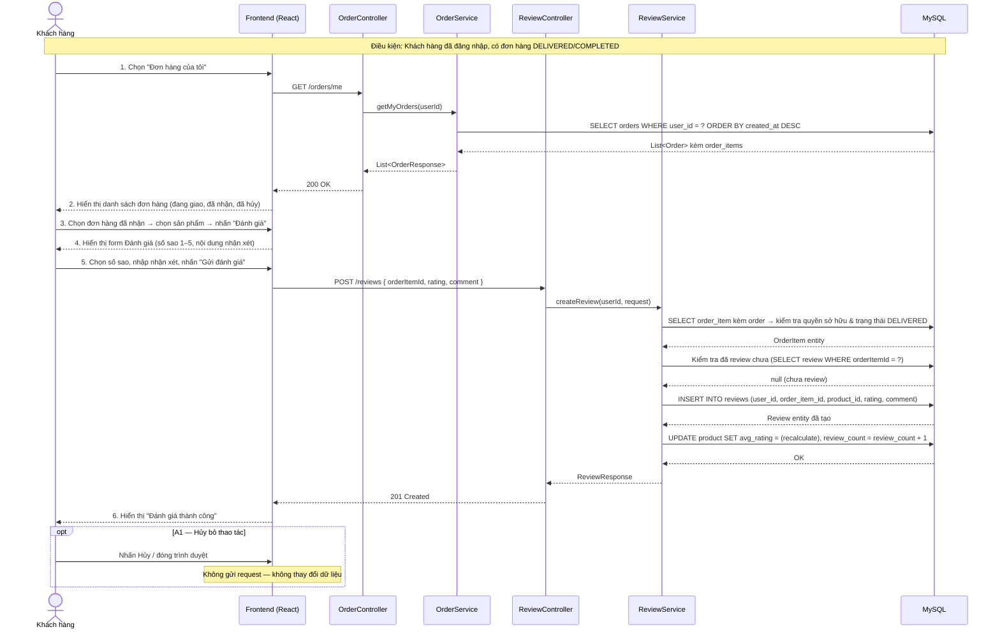
```mermaid
sequenceDiagram
    actor KH as Khách hàng
    participant FE as Frontend (React)
    participant OC as OrderController
    participant OS as OrderService
    participant RC as ReviewController
    participant RS as ReviewService
    participant DB as MySQL

    Note over KH,DB: Điều kiện: Khách hàng đã đăng nhập, có đơn hàng DELIVERED/COMPLETED

    KH->>FE: 1. Chọn "Đơn hàng của tôi"
    FE->>OC: GET /orders/me
    OC->>OS: getMyOrders(userId)
    OS->>DB: SELECT orders WHERE user_id = ? ORDER BY created_at DESC
    DB-->>OS: List<Order> kèm order_items
    OS-->>OC: List<OrderResponse>
    OC-->>FE: 200 OK
    FE-->>KH: 2. Hiển thị danh sách đơn hàng (đang giao, đã nhận, đã hủy)

    KH->>FE: 3. Chọn đơn hàng đã nhận → chọn sản phẩm → nhấn "Đánh giá"
    FE-->>KH: 4. Hiển thị form Đánh giá (số sao 1–5, nội dung nhận xét)

    KH->>FE: 5. Chọn số sao, nhập nhận xét, nhấn "Gửi đánh giá"
    FE->>RC: POST /reviews { orderItemId, rating, comment }
    RC->>RS: createReview(userId, request)
    RS->>DB: SELECT order_item kèm order → kiểm tra quyền sở hữu & trạng thái DELIVERED
    DB-->>RS: OrderItem entity

    RS->>DB: Kiểm tra đã review chưa (SELECT review WHERE orderItemId = ?)
    DB-->>RS: null (chưa review)

    RS->>DB: INSERT INTO reviews (user_id, order_item_id, product_id, rating, comment)
    DB-->>RS: Review entity đã tạo
    RS->>DB: UPDATE product SET avg_rating = (recalculate), review_count = review_count + 1
    DB-->>RS: OK

    RS-->>RC: ReviewResponse
    RC-->>FE: 201 Created
    FE-->>KH: 6. Hiển thị "Đánh giá thành công"

    opt A1 — Hủy bỏ thao tác
        KH->>FE: Nhấn Hủy / đóng trình duyệt
        Note over FE: Không gửi request — không thay đổi dữ liệu
    end
```

---

## UC07 — Nhắn tin

**Tác nhân:** Khách hàng &nbsp;|&nbsp; **Mô tả:** Trao đổi trực tiếp với shop qua chat realtime.

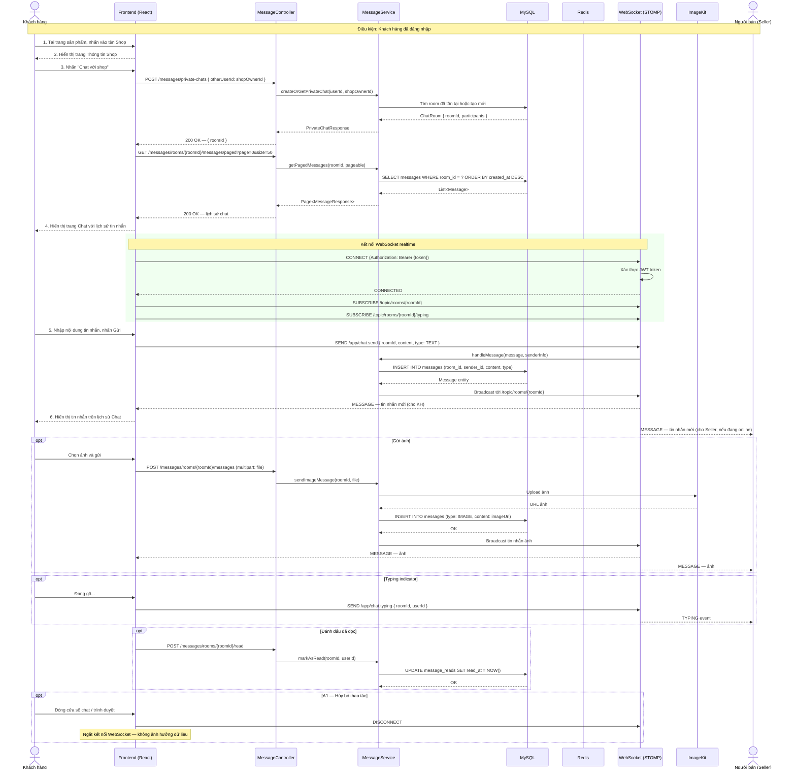
```mermaid
sequenceDiagram
    actor KH as Khách hàng
    participant FE as Frontend (React)
    participant MC as MessageController
    participant MS as MessageService
    participant DB as MySQL
    participant Redis as Redis
    participant WS as WebSocket (STOMP)
    participant IK as ImageKit
    actor NB as Người bán (Seller)

    Note over KH,NB: Điều kiện: Khách hàng đã đăng nhập

    KH->>FE: 1. Tại trang sản phẩm, nhấn vào tên Shop
    FE-->>KH: 2. Hiển thị trang Thông tin Shop
    KH->>FE: 3. Nhấn "Chat với shop"

    FE->>MC: POST /messages/private-chats { otherUserId: shopOwnerId }
    MC->>MS: createOrGetPrivateChat(userId, shopOwnerId)
    MS->>DB: Tìm room đã tồn tại hoặc tạo mới
    DB-->>MS: ChatRoom { roomId, participants }
    MS-->>MC: PrivateChatResponse
    MC-->>FE: 200 OK — { roomId }

    FE->>MC: GET /messages/rooms/{roomId}/messages/paged?page=0&size=50
    MC->>MS: getPagedMessages(roomId, pageable)
    MS->>DB: SELECT messages WHERE room_id = ? ORDER BY created_at DESC
    DB-->>MS: List<Message>
    MS-->>MC: Page<MessageResponse>
    MC-->>FE: 200 OK — lịch sử chat
    FE-->>KH: 4. Hiển thị trang Chat với lịch sử tin nhắn

    rect rgb(240, 255, 240)
        Note over FE,WS: Kết nối WebSocket realtime
        FE->>WS: CONNECT (Authorization: Bearer {token})
        WS->>WS: Xác thực JWT token
        WS-->>FE: CONNECTED
        FE->>WS: SUBSCRIBE /topic/rooms/{roomId}
        FE->>WS: SUBSCRIBE /topic/rooms/{roomId}/typing
    end

    KH->>FE: 5. Nhập nội dung tin nhắn, nhấn Gửi
    FE->>WS: SEND /app/chat.send { roomId, content, type: TEXT }
    WS->>MS: handleMessage(message, senderInfo)
    MS->>DB: INSERT INTO messages (room_id, sender_id, content, type)
    DB-->>MS: Message entity
    MS->>WS: Broadcast tới /topic/rooms/{roomId}

    WS-->>FE: MESSAGE — tin nhắn mới (cho KH)
    FE-->>KH: 6. Hiển thị tin nhắn trên lịch sử Chat

    WS-->>NB: MESSAGE — tin nhắn mới (cho Seller, nếu đang online)

    opt Gửi ảnh
        KH->>FE: Chọn ảnh và gửi
        FE->>MC: POST /messages/rooms/{roomId}/messages (multipart: file)
        MC->>MS: sendImageMessage(roomId, file)
        MS->>IK: Upload ảnh
        IK-->>MS: URL ảnh
        MS->>DB: INSERT INTO messages (type: IMAGE, content: imageUrl)
        DB-->>MS: OK
        MS->>WS: Broadcast tin nhắn ảnh
        WS-->>FE: MESSAGE — ảnh
        WS-->>NB: MESSAGE — ảnh
    end

    opt Typing indicator
        KH->>FE: Đang gõ...
        FE->>WS: SEND /app/chat.typing { roomId, userId }
        WS-->>NB: TYPING event
    end

    opt Đánh dấu đã đọc
        FE->>MC: POST /messages/rooms/{roomId}/read
        MC->>MS: markAsRead(roomId, userId)
        MS->>DB: UPDATE message_reads SET read_at = NOW()
        DB-->>MS: OK
    end

    opt A1 — Hủy bỏ thao tác
        KH->>FE: Đóng cửa sổ chat / trình duyệt
        FE->>WS: DISCONNECT
        Note over FE: Ngắt kết nối WebSocket — không ảnh hưởng dữ liệu
    end
```

---

## UC08 — Quản lý shop (Admin)

**Tác nhân:** Quản trị viên &nbsp;|&nbsp; **Mô tả:** Duyệt shop mới, theo dõi và đình chỉ shop vi phạm.

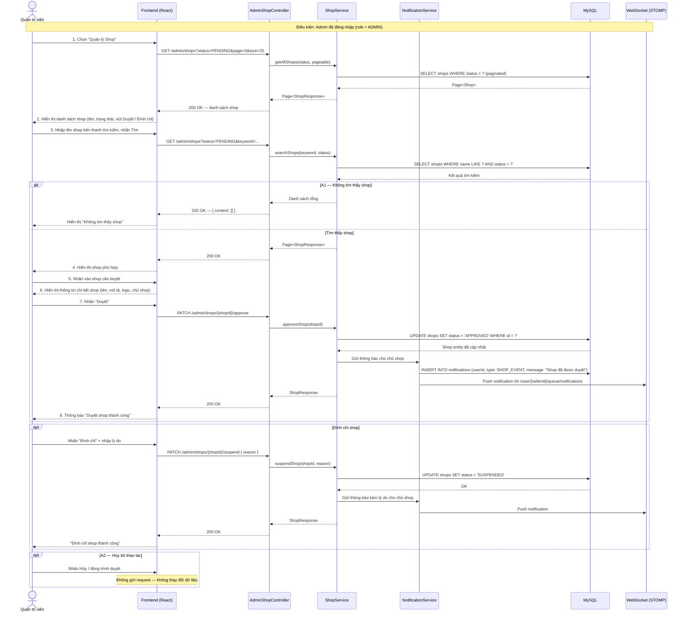
```mermaid
sequenceDiagram
    actor Admin as Quản trị viên
    participant FE as Frontend (React)
    participant ASC as AdminShopController
    participant SS as ShopService
    participant NS as NotificationService
    participant DB as MySQL
    participant WS as WebSocket (STOMP)

    Note over Admin,WS: Điều kiện: Admin đã đăng nhập (role = ADMIN)

    Admin->>FE: 1. Chọn "Quản lý Shop"
    FE->>ASC: GET /admin/shops?status=PENDING&page=0&size=20
    ASC->>SS: getAllShops(status, pageable)
    SS->>DB: SELECT shops WHERE status = ? (paginated)
    DB-->>SS: Page<Shop>
    SS-->>ASC: Page<ShopResponse>
    ASC-->>FE: 200 OK — danh sách shop
    FE-->>Admin: 2. Hiển thị danh sách shop (tên, trạng thái, nút Duyệt / Đình chỉ)

    Admin->>FE: 3. Nhập tên shop trên thanh tìm kiếm, nhấn Tìm
    FE->>ASC: GET /admin/shops?status=PENDING&keyword=...
    ASC->>SS: searchShops(keyword, status)
    SS->>DB: SELECT shops WHERE name LIKE ? AND status = ?
    DB-->>SS: Kết quả tìm kiếm

    alt A1 — Không tìm thấy shop
        SS-->>ASC: Danh sách rỗng
        ASC-->>FE: 200 OK — { content: [] }
        FE-->>Admin: Hiển thị "Không tìm thấy shop"
    else Tìm thấy shop
        SS-->>ASC: Page<ShopResponse>
        ASC-->>FE: 200 OK
        FE-->>Admin: 4. Hiển thị shop phù hợp

        Admin->>FE: 5. Nhấn vào shop cần duyệt
        FE-->>Admin: 6. Hiển thị thông tin chi tiết shop (tên, mô tả, logo, chủ shop)

        Admin->>FE: 7. Nhấn "Duyệt"
        FE->>ASC: PATCH /admin/shops/{shopId}/approve
        ASC->>SS: approveShop(shopId)
        SS->>DB: UPDATE shops SET status = 'APPROVED' WHERE id = ?
        DB-->>SS: Shop entity đã cập nhật

        SS->>NS: Gửi thông báo cho chủ shop
        NS->>DB: INSERT INTO notifications (userId, type: SHOP_EVENT, message: "Shop đã được duyệt")
        NS->>WS: Push notification tới /user/{sellerId}/queue/notifications

        SS-->>ASC: ShopResponse
        ASC-->>FE: 200 OK
        FE-->>Admin: 8. Thông báo "Duyệt shop thành công"
    end

    opt Đình chỉ shop
        Admin->>FE: Nhấn "Đình chỉ" + nhập lý do
        FE->>ASC: PATCH /admin/shops/{shopId}/suspend { reason }
        ASC->>SS: suspendShop(shopId, reason)
        SS->>DB: UPDATE shops SET status = 'SUSPENDED'
        DB-->>SS: OK
        SS->>NS: Gửi thông báo kèm lý do cho chủ shop
        NS->>WS: Push notification
        SS-->>ASC: ShopResponse
        ASC-->>FE: 200 OK
        FE-->>Admin: "Đình chỉ shop thành công"
    end

    opt A2 — Hủy bỏ thao tác
        Admin->>FE: Nhấn Hủy / đóng trình duyệt
        Note over FE: Không gửi request — không thay đổi dữ liệu
    end
```

---

## UC09 — Quản lý người dùng (Admin)

**Tác nhân:** Quản trị viên &nbsp;|&nbsp; **Mô tả:** Xem danh sách, khóa / mở khóa tài khoản và phân quyền.

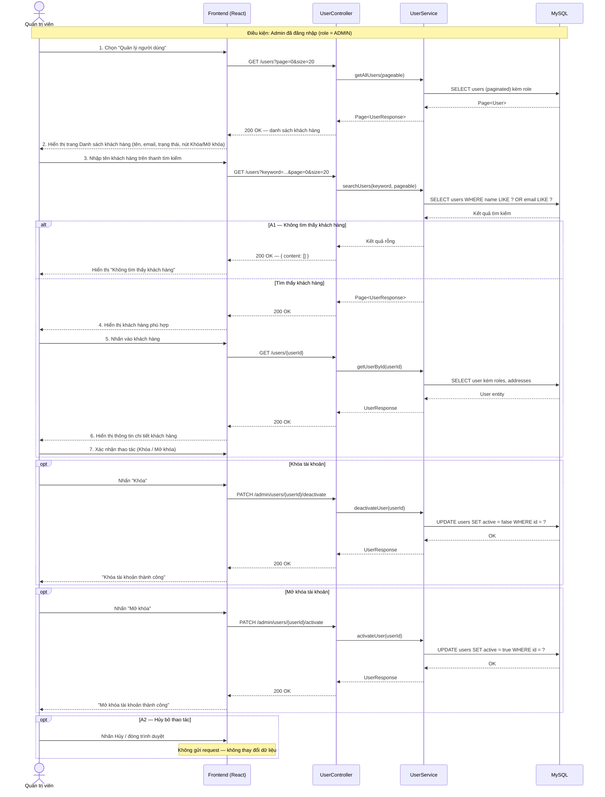
```mermaid
sequenceDiagram
    actor Admin as Quản trị viên
    participant FE as Frontend (React)
    participant UC as UserController
    participant US as UserService
    participant DB as MySQL

    Note over Admin,DB: Điều kiện: Admin đã đăng nhập (role = ADMIN)

    Admin->>FE: 1. Chọn "Quản lý người dùng"
    FE->>UC: GET /users?page=0&size=20
    UC->>US: getAllUsers(pageable)
    US->>DB: SELECT users (paginated) kèm role
    DB-->>US: Page<User>
    US-->>UC: Page<UserResponse>
    UC-->>FE: 200 OK — danh sách khách hàng
    FE-->>Admin: 2. Hiển thị trang Danh sách khách hàng (tên, email, trạng thái, nút Khóa/Mở khóa)

    Admin->>FE: 3. Nhập tên khách hàng trên thanh tìm kiếm
    FE->>UC: GET /users?keyword=...&page=0&size=20
    UC->>US: searchUsers(keyword, pageable)
    US->>DB: SELECT users WHERE name LIKE ? OR email LIKE ?
    DB-->>US: Kết quả tìm kiếm

    alt A1 — Không tìm thấy khách hàng
        US-->>UC: Kết quả rỗng
        UC-->>FE: 200 OK — { content: [] }
        FE-->>Admin: Hiển thị "Không tìm thấy khách hàng"
    else Tìm thấy khách hàng
        US-->>UC: Page<UserResponse>
        UC-->>FE: 200 OK
        FE-->>Admin: 4. Hiển thị khách hàng phù hợp

        Admin->>FE: 5. Nhấn vào khách hàng
        FE->>UC: GET /users/{userId}
        UC->>US: getUserById(userId)
        US->>DB: SELECT user kèm roles, addresses
        DB-->>US: User entity
        US-->>UC: UserResponse
        UC-->>FE: 200 OK
        FE-->>Admin: 6. Hiển thị thông tin chi tiết khách hàng

        Admin->>FE: 7. Xác nhận thao tác (Khóa / Mở khóa)
    end

    opt Khóa tài khoản
        Admin->>FE: Nhấn "Khóa"
        FE->>UC: PATCH /admin/users/{userId}/deactivate
        UC->>US: deactivateUser(userId)
        US->>DB: UPDATE users SET active = false WHERE id = ?
        DB-->>US: OK
        US-->>UC: UserResponse
        UC-->>FE: 200 OK
        FE-->>Admin: "Khóa tài khoản thành công"
    end

    opt Mở khóa tài khoản
        Admin->>FE: Nhấn "Mở khóa"
        FE->>UC: PATCH /admin/users/{userId}/activate
        UC->>US: activateUser(userId)
        US->>DB: UPDATE users SET active = true WHERE id = ?
        DB-->>US: OK
        US-->>UC: UserResponse
        UC-->>FE: 200 OK
        FE-->>Admin: "Mở khóa tài khoản thành công"
    end

    opt A2 — Hủy bỏ thao tác
        Admin->>FE: Nhấn Hủy / đóng trình duyệt
        Note over FE: Không gửi request — không thay đổi dữ liệu
    end
```

---

## UC10 — Quản lý danh mục sản phẩm (Admin)

**Tác nhân:** Quản trị viên &nbsp;|&nbsp; **Mô tả:** Tạo / sửa / xóa danh mục sản phẩm cho hệ thống.

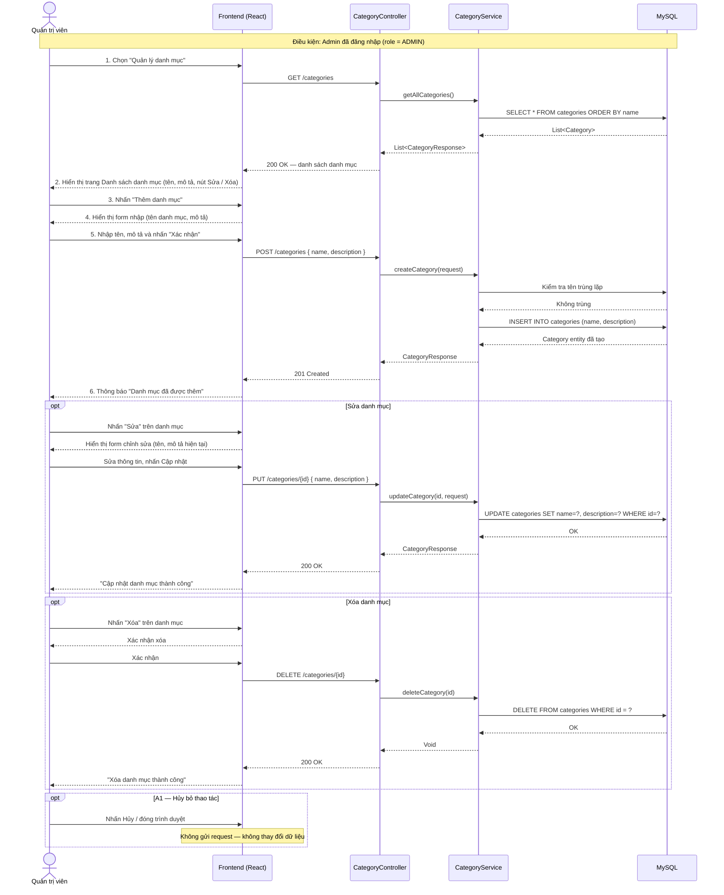
```mermaid
sequenceDiagram
    actor Admin as Quản trị viên
    participant FE as Frontend (React)
    participant CaC as CategoryController
    participant CaS as CategoryService
    participant DB as MySQL

    Note over Admin,DB: Điều kiện: Admin đã đăng nhập (role = ADMIN)

    Admin->>FE: 1. Chọn "Quản lý danh mục"
    FE->>CaC: GET /categories
    CaC->>CaS: getAllCategories()
    CaS->>DB: SELECT * FROM categories ORDER BY name
    DB-->>CaS: List<Category>
    CaS-->>CaC: List<CategoryResponse>
    CaC-->>FE: 200 OK — danh sách danh mục
    FE-->>Admin: 2. Hiển thị trang Danh sách danh mục (tên, mô tả, nút Sửa / Xóa)

    Admin->>FE: 3. Nhấn "Thêm danh mục"
    FE-->>Admin: 4. Hiển thị form nhập (tên danh mục, mô tả)
    Admin->>FE: 5. Nhập tên, mô tả và nhấn "Xác nhận"
    FE->>CaC: POST /categories { name, description }
    CaC->>CaS: createCategory(request)
    CaS->>DB: Kiểm tra tên trùng lặp
    DB-->>CaS: Không trùng
    CaS->>DB: INSERT INTO categories (name, description)
    DB-->>CaS: Category entity đã tạo
    CaS-->>CaC: CategoryResponse
    CaC-->>FE: 201 Created
    FE-->>Admin: 6. Thông báo "Danh mục đã được thêm"

    opt Sửa danh mục
        Admin->>FE: Nhấn "Sửa" trên danh mục
        FE-->>Admin: Hiển thị form chỉnh sửa (tên, mô tả hiện tại)
        Admin->>FE: Sửa thông tin, nhấn Cập nhật
        FE->>CaC: PUT /categories/{id} { name, description }
        CaC->>CaS: updateCategory(id, request)
        CaS->>DB: UPDATE categories SET name=?, description=? WHERE id=?
        DB-->>CaS: OK
        CaS-->>CaC: CategoryResponse
        CaC-->>FE: 200 OK
        FE-->>Admin: "Cập nhật danh mục thành công"
    end

    opt Xóa danh mục
        Admin->>FE: Nhấn "Xóa" trên danh mục
        FE-->>Admin: Xác nhận xóa
        Admin->>FE: Xác nhận
        FE->>CaC: DELETE /categories/{id}
        CaC->>CaS: deleteCategory(id)
        CaS->>DB: DELETE FROM categories WHERE id = ?
        DB-->>CaS: OK
        CaS-->>CaC: Void
        CaC-->>FE: 200 OK
        FE-->>Admin: "Xóa danh mục thành công"
    end

    opt A1 — Hủy bỏ thao tác
        Admin->>FE: Nhấn Hủy / đóng trình duyệt
        Note over FE: Không gửi request — không thay đổi dữ liệu
    end
```

---

## UC11 — Đăng ký shop

**Tác nhân:** Người bán (Seller) &nbsp;|&nbsp; **Mô tả:** Gửi yêu cầu mở shop và chờ quản trị viên duyệt.

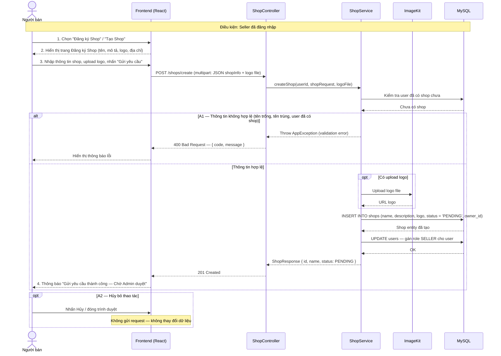
```mermaid
sequenceDiagram
    actor Seller as Người bán
    participant FE as Frontend (React)
    participant ShC as ShopController
    participant ShS as ShopService
    participant IK as ImageKit
    participant DB as MySQL

    Note over Seller,DB: Điều kiện: Seller đã đăng nhập

    Seller->>FE: 1. Chọn "Đăng ký Shop" / "Tạo Shop"
    FE-->>Seller: 2. Hiển thị trang Đăng ký Shop (tên, mô tả, logo, địa chỉ)

    Seller->>FE: 3. Nhập thông tin shop, upload logo, nhấn "Gửi yêu cầu"
    FE->>ShC: POST /shops/create (multipart: JSON shopInfo + logo file)
    ShC->>ShS: createShop(userId, shopRequest, logoFile)

    ShS->>DB: Kiểm tra user đã có shop chưa
    DB-->>ShS: Chưa có shop

    alt A1 — Thông tin không hợp lệ (tên trống, tên trùng, user đã có shop)
        ShS-->>ShC: Throw AppException (validation error)
        ShC-->>FE: 400 Bad Request — { code, message }
        FE-->>Seller: Hiển thị thông báo lỗi
    else Thông tin hợp lệ
        opt Có upload logo
            ShS->>IK: Upload logo file
            IK-->>ShS: URL logo
        end

        ShS->>DB: INSERT INTO shops (name, description, logo, status = 'PENDING', owner_id)
        DB-->>ShS: Shop entity đã tạo
        ShS->>DB: UPDATE users — gán role SELLER cho user
        DB-->>ShS: OK

        ShS-->>ShC: ShopResponse { id, name, status: PENDING }
        ShC-->>FE: 201 Created
        FE-->>Seller: 4. Thông báo "Gửi yêu cầu thành công — Chờ Admin duyệt"
    end

    opt A2 — Hủy bỏ thao tác
        Seller->>FE: Nhấn Hủy / đóng trình duyệt
        Note over FE: Không gửi request — không thay đổi dữ liệu
    end
```

---

## UC12 — Quản lý thông tin shop

**Tác nhân:** Người bán (Seller) &nbsp;|&nbsp; **Mô tả:** Cập nhật tên, mô tả, logo, kho và địa chỉ shop.

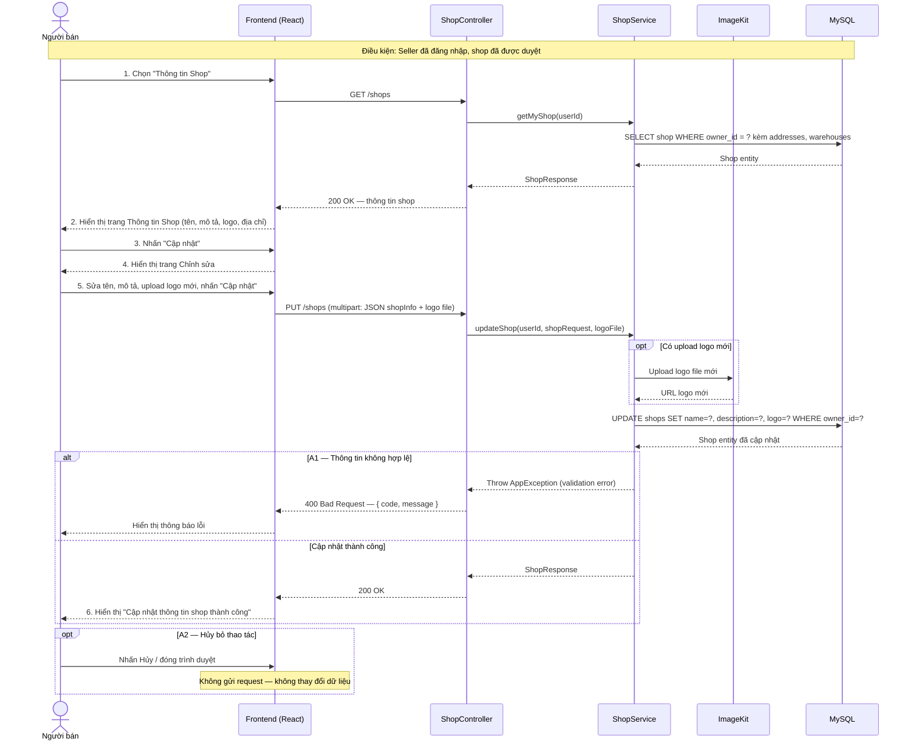
```mermaid
sequenceDiagram
    actor Seller as Người bán
    participant FE as Frontend (React)
    participant ShC as ShopController
    participant ShS as ShopService
    participant IK as ImageKit
    participant DB as MySQL

    Note over Seller,DB: Điều kiện: Seller đã đăng nhập, shop đã được duyệt

    Seller->>FE: 1. Chọn "Thông tin Shop"
    FE->>ShC: GET /shops
    ShC->>ShS: getMyShop(userId)
    ShS->>DB: SELECT shop WHERE owner_id = ? kèm addresses, warehouses
    DB-->>ShS: Shop entity
    ShS-->>ShC: ShopResponse
    ShC-->>FE: 200 OK — thông tin shop
    FE-->>Seller: 2. Hiển thị trang Thông tin Shop (tên, mô tả, logo, địa chỉ)

    Seller->>FE: 3. Nhấn "Cập nhật"
    FE-->>Seller: 4. Hiển thị trang Chỉnh sửa

    Seller->>FE: 5. Sửa tên, mô tả, upload logo mới, nhấn "Cập nhật"
    FE->>ShC: PUT /shops (multipart: JSON shopInfo + logo file)
    ShC->>ShS: updateShop(userId, shopRequest, logoFile)

    opt Có upload logo mới
        ShS->>IK: Upload logo file mới
        IK-->>ShS: URL logo mới
    end

    ShS->>DB: UPDATE shops SET name=?, description=?, logo=? WHERE owner_id=?
    DB-->>ShS: Shop entity đã cập nhật

    alt A1 — Thông tin không hợp lệ
        ShS-->>ShC: Throw AppException (validation error)
        ShC-->>FE: 400 Bad Request — { code, message }
        FE-->>Seller: Hiển thị thông báo lỗi
    else Cập nhật thành công
        ShS-->>ShC: ShopResponse
        ShC-->>FE: 200 OK
        FE-->>Seller: 6. Hiển thị "Cập nhật thông tin shop thành công"
    end

    opt A2 — Hủy bỏ thao tác
        Seller->>FE: Nhấn Hủy / đóng trình duyệt
        Note over FE: Không gửi request — không thay đổi dữ liệu
    end
```

---

## UC13 — Quản lý sản phẩm

**Tác nhân:** Người bán (Seller) &nbsp;|&nbsp; **Mô tả:** Tạo / sửa / xóa sản phẩm, mô tả, thuộc tính và ảnh.

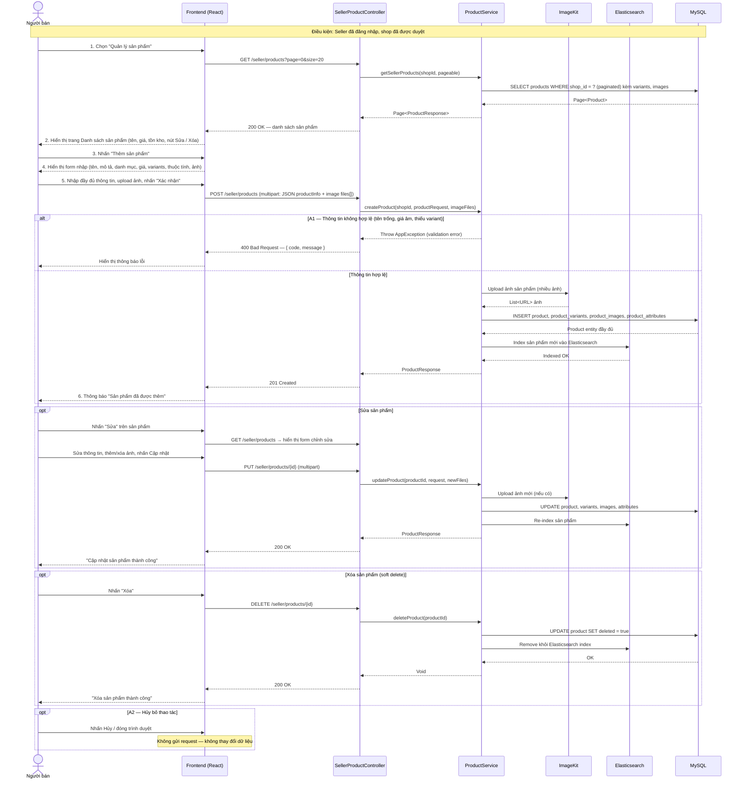
```mermaid
sequenceDiagram
    actor Seller as Người bán
    participant FE as Frontend (React)
    participant SPC as SellerProductController
    participant PS as ProductService
    participant IK as ImageKit
    participant ES as Elasticsearch
    participant DB as MySQL

    Note over Seller,DB: Điều kiện: Seller đã đăng nhập, shop đã được duyệt

    Seller->>FE: 1. Chọn "Quản lý sản phẩm"
    FE->>SPC: GET /seller/products?page=0&size=20
    SPC->>PS: getSellerProducts(shopId, pageable)
    PS->>DB: SELECT products WHERE shop_id = ? (paginated) kèm variants, images
    DB-->>PS: Page<Product>
    PS-->>SPC: Page<ProductResponse>
    SPC-->>FE: 200 OK — danh sách sản phẩm
    FE-->>Seller: 2. Hiển thị trang Danh sách sản phẩm (tên, giá, tồn kho, nút Sửa / Xóa)

    Seller->>FE: 3. Nhấn "Thêm sản phẩm"
    FE-->>Seller: 4. Hiển thị form nhập (tên, mô tả, danh mục, giá, variants, thuộc tính, ảnh)

    Seller->>FE: 5. Nhập đầy đủ thông tin, upload ảnh, nhấn "Xác nhận"
    FE->>SPC: POST /seller/products (multipart: JSON productInfo + image files[])
    SPC->>PS: createProduct(shopId, productRequest, imageFiles)

    alt A1 — Thông tin không hợp lệ (tên trống, giá âm, thiếu variant)
        PS-->>SPC: Throw AppException (validation error)
        SPC-->>FE: 400 Bad Request — { code, message }
        FE-->>Seller: Hiển thị thông báo lỗi
    else Thông tin hợp lệ
        PS->>IK: Upload ảnh sản phẩm (nhiều ảnh)
        IK-->>PS: List<URL> ảnh

        PS->>DB: INSERT product, product_variants, product_images, product_attributes
        DB-->>PS: Product entity đầy đủ

        PS->>ES: Index sản phẩm mới vào Elasticsearch
        ES-->>PS: Indexed OK

        PS-->>SPC: ProductResponse
        SPC-->>FE: 201 Created
        FE-->>Seller: 6. Thông báo "Sản phẩm đã được thêm"
    end

    opt Sửa sản phẩm
        Seller->>FE: Nhấn "Sửa" trên sản phẩm
        FE->>SPC: GET /seller/products → hiển thị form chỉnh sửa
        Seller->>FE: Sửa thông tin, thêm/xóa ảnh, nhấn Cập nhật
        FE->>SPC: PUT /seller/products/{id} (multipart)
        SPC->>PS: updateProduct(productId, request, newFiles)
        PS->>IK: Upload ảnh mới (nếu có)
        PS->>DB: UPDATE product, variants, images, attributes
        PS->>ES: Re-index sản phẩm
        PS-->>SPC: ProductResponse
        SPC-->>FE: 200 OK
        FE-->>Seller: "Cập nhật sản phẩm thành công"
    end

    opt Xóa sản phẩm (soft delete)
        Seller->>FE: Nhấn "Xóa"
        FE->>SPC: DELETE /seller/products/{id}
        SPC->>PS: deleteProduct(productId)
        PS->>DB: UPDATE product SET deleted = true
        PS->>ES: Remove khỏi Elasticsearch index
        DB-->>PS: OK
        PS-->>SPC: Void
        SPC-->>FE: 200 OK
        FE-->>Seller: "Xóa sản phẩm thành công"
    end

    opt A2 — Hủy bỏ thao tác
        Seller->>FE: Nhấn Hủy / đóng trình duyệt
        Note over FE: Không gửi request — không thay đổi dữ liệu
    end
```

---

## UC14 — Quản lý đơn hàng (Seller)

**Tác nhân:** Người bán (Seller) &nbsp;|&nbsp; **Mô tả:** Xem, xác nhận, cập nhật trạng thái và hủy đơn của shop.

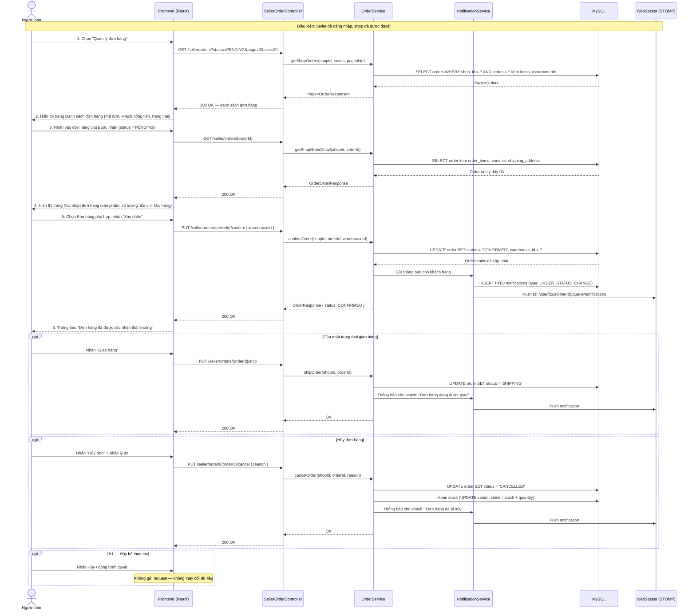
```mermaid
sequenceDiagram
    actor Seller as Người bán
    participant FE as Frontend (React)
    participant SOC as SellerOrderController
    participant OS as OrderService
    participant NS as NotificationService
    participant DB as MySQL
    participant WS as WebSocket (STOMP)

    Note over Seller,WS: Điều kiện: Seller đã đăng nhập, shop đã được duyệt

    Seller->>FE: 1. Chọn "Quản lý đơn hàng"
    FE->>SOC: GET /seller/orders?status=PENDING&page=0&size=20
    SOC->>OS: getShopOrders(shopId, status, pageable)
    OS->>DB: SELECT orders WHERE shop_id = ? AND status = ? kèm items, customer info
    DB-->>OS: Page<Order>
    OS-->>SOC: Page<OrderResponse>
    SOC-->>FE: 200 OK — danh sách đơn hàng
    FE-->>Seller: 2. Hiển thị trang Danh sách đơn hàng (mã đơn, khách, tổng tiền, trạng thái)

    Seller->>FE: 3. Nhấn vào đơn hàng chưa xác nhận (status = PENDING)
    FE->>SOC: GET /seller/orders/{orderId}
    SOC->>OS: getShopOrderDetail(shopId, orderId)
    OS->>DB: SELECT order kèm order_items, variants, shipping_address
    DB-->>OS: Order entity đầy đủ
    OS-->>SOC: OrderDetailResponse
    SOC-->>FE: 200 OK
    FE-->>Seller: 4. Hiển thị trang Xác nhận đơn hàng (sản phẩm, số lượng, địa chỉ, kho hàng)

    Seller->>FE: 5. Chọn Kho hàng phù hợp, nhấn "Xác nhận"
    FE->>SOC: PUT /seller/orders/{orderId}/confirm { warehouseId }
    SOC->>OS: confirmOrder(shopId, orderId, warehouseId)
    OS->>DB: UPDATE order SET status = 'CONFIRMED', warehouse_id = ?
    DB-->>OS: Order entity đã cập nhật

    OS->>NS: Gửi thông báo cho khách hàng
    NS->>DB: INSERT INTO notifications (type: ORDER_STATUS_CHANGE)
    NS->>WS: Push tới /user/{customerId}/queue/notifications

    OS-->>SOC: OrderResponse { status: CONFIRMED }
    SOC-->>FE: 200 OK
    FE-->>Seller: 6. Thông báo "Đơn hàng đã được xác nhận thành công"

    opt Cập nhật trạng thái giao hàng
        Seller->>FE: Nhấn "Giao hàng"
        FE->>SOC: PUT /seller/orders/{orderId}/ship
        SOC->>OS: shipOrder(shopId, orderId)
        OS->>DB: UPDATE order SET status = 'SHIPPING'
        OS->>NS: Thông báo cho khách: "Đơn hàng đang được giao"
        NS->>WS: Push notification
        OS-->>SOC: OK
        SOC-->>FE: 200 OK
    end

    opt Hủy đơn hàng
        Seller->>FE: Nhấn "Hủy đơn" + nhập lý do
        FE->>SOC: PUT /seller/orders/{orderId}/cancel { reason }
        SOC->>OS: cancelOrder(shopId, orderId, reason)
        OS->>DB: UPDATE order SET status = 'CANCELLED'
        OS->>DB: Hoàn stock (UPDATE variant stock = stock + quantity)
        OS->>NS: Thông báo cho khách: "Đơn hàng đã bị hủy"
        NS->>WS: Push notification
        OS-->>SOC: OK
        SOC-->>FE: 200 OK
    end

    opt A1 — Hủy bỏ thao tác
        Seller->>FE: Nhấn Hủy / đóng trình duyệt
        Note over FE: Không gửi request — không thay đổi dữ liệu
    end
```

---

## UC15 — Quản lý mã giảm giá

**Tác nhân:** Người bán (Seller) &nbsp;|&nbsp; **Mô tả:** Tạo, chỉnh sửa và vô hiệu hóa voucher của shop.

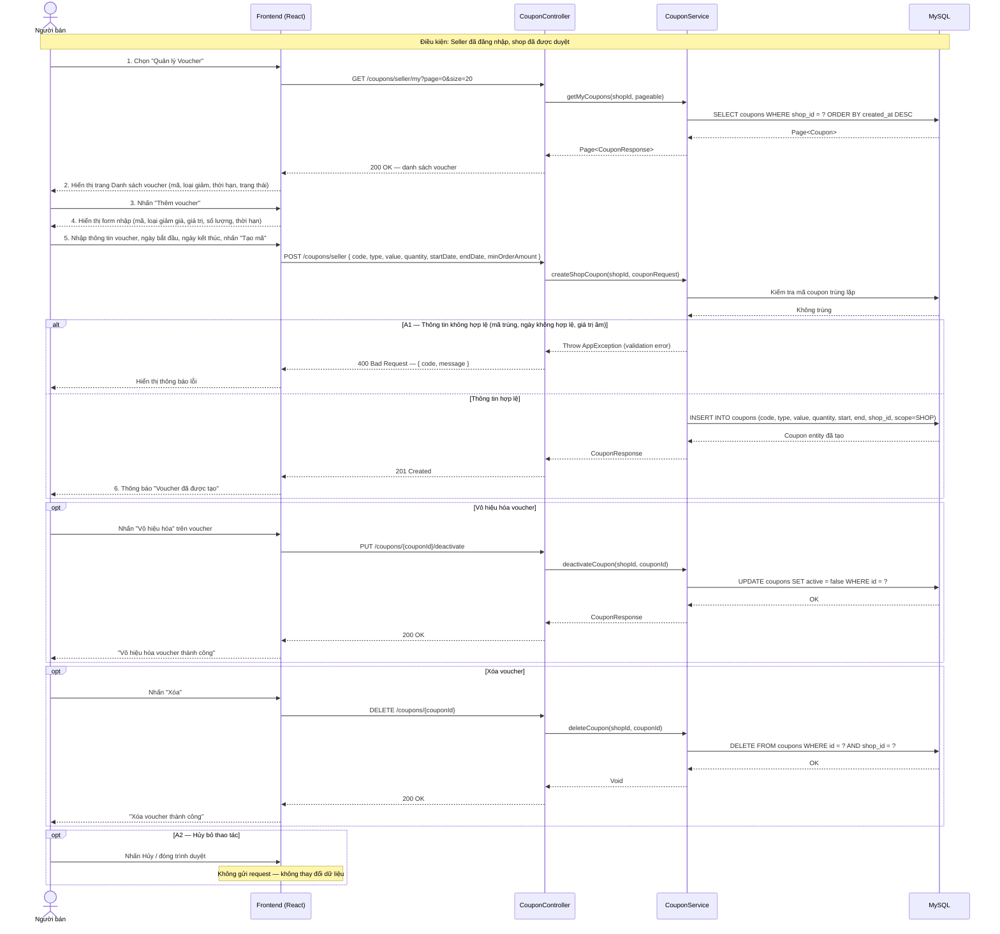
```mermaid
sequenceDiagram
    actor Seller as Người bán
    participant FE as Frontend (React)
    participant CoC as CouponController
    participant CoS as CouponService
    participant DB as MySQL

    Note over Seller,DB: Điều kiện: Seller đã đăng nhập, shop đã được duyệt

    Seller->>FE: 1. Chọn "Quản lý Voucher"
    FE->>CoC: GET /coupons/seller/my?page=0&size=20
    CoC->>CoS: getMyCoupons(shopId, pageable)
    CoS->>DB: SELECT coupons WHERE shop_id = ? ORDER BY created_at DESC
    DB-->>CoS: Page<Coupon>
    CoS-->>CoC: Page<CouponResponse>
    CoC-->>FE: 200 OK — danh sách voucher
    FE-->>Seller: 2. Hiển thị trang Danh sách voucher (mã, loại giảm, thời hạn, trạng thái)

    Seller->>FE: 3. Nhấn "Thêm voucher"
    FE-->>Seller: 4. Hiển thị form nhập (mã, loại giảm giá, giá trị, số lượng, thời hạn)

    Seller->>FE: 5. Nhập thông tin voucher, ngày bắt đầu, ngày kết thúc, nhấn "Tạo mã"
    FE->>CoC: POST /coupons/seller { code, type, value, quantity, startDate, endDate, minOrderAmount }
    CoC->>CoS: createShopCoupon(shopId, couponRequest)
    CoS->>DB: Kiểm tra mã coupon trùng lặp
    DB-->>CoS: Không trùng

    alt A1 — Thông tin không hợp lệ (mã trùng, ngày không hợp lệ, giá trị âm)
        CoS-->>CoC: Throw AppException (validation error)
        CoC-->>FE: 400 Bad Request — { code, message }
        FE-->>Seller: Hiển thị thông báo lỗi
    else Thông tin hợp lệ
        CoS->>DB: INSERT INTO coupons (code, type, value, quantity, start, end, shop_id, scope=SHOP)
        DB-->>CoS: Coupon entity đã tạo
        CoS-->>CoC: CouponResponse
        CoC-->>FE: 201 Created
        FE-->>Seller: 6. Thông báo "Voucher đã được tạo"
    end

    opt Vô hiệu hóa voucher
        Seller->>FE: Nhấn "Vô hiệu hóa" trên voucher
        FE->>CoC: PUT /coupons/{couponId}/deactivate
        CoC->>CoS: deactivateCoupon(shopId, couponId)
        CoS->>DB: UPDATE coupons SET active = false WHERE id = ?
        DB-->>CoS: OK
        CoS-->>CoC: CouponResponse
        CoC-->>FE: 200 OK
        FE-->>Seller: "Vô hiệu hóa voucher thành công"
    end

    opt Xóa voucher
        Seller->>FE: Nhấn "Xóa"
        FE->>CoC: DELETE /coupons/{couponId}
        CoC->>CoS: deleteCoupon(shopId, couponId)
        CoS->>DB: DELETE FROM coupons WHERE id = ? AND shop_id = ?
        DB-->>CoS: OK
        CoS-->>CoC: Void
        CoC-->>FE: 200 OK
        FE-->>Seller: "Xóa voucher thành công"
    end

    opt A2 — Hủy bỏ thao tác
        Seller->>FE: Nhấn Hủy / đóng trình duyệt
        Note over FE: Không gửi request — không thay đổi dữ liệu
    end
```

---

## UC16 — Quản lý nhân viên kho

**Tác nhân:** Người bán (Seller) &nbsp;|&nbsp; **Mô tả:** Đăng ký, phân công hoặc gỡ nhân viên khỏi kho hàng.

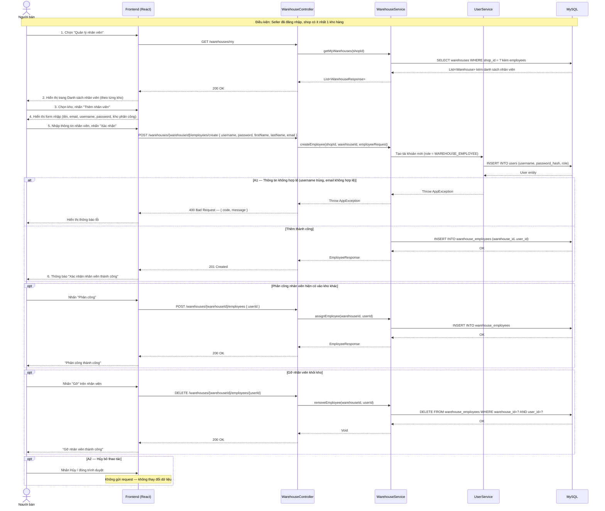
```mermaid
sequenceDiagram
    actor Seller as Người bán
    participant FE as Frontend (React)
    participant WC as WarehouseController
    participant WS as WarehouseService
    participant US as UserService
    participant DB as MySQL

    Note over Seller,DB: Điều kiện: Seller đã đăng nhập, shop có ít nhất 1 kho hàng

    Seller->>FE: 1. Chọn "Quản lý nhân viên"
    FE->>WC: GET /warehouses/my
    WC->>WS: getMyWarehouses(shopId)
    WS->>DB: SELECT warehouses WHERE shop_id = ? kèm employees
    DB-->>WS: List<Warehouse> kèm danh sách nhân viên
    WS-->>WC: List<WarehouseResponse>
    WC-->>FE: 200 OK
    FE-->>Seller: 2. Hiển thị trang Danh sách nhân viên (theo từng kho)

    Seller->>FE: 3. Chọn kho, nhấn "Thêm nhân viên"
    FE-->>Seller: 4. Hiển thị form nhập (tên, email, username, password, kho phân công)

    Seller->>FE: 5. Nhập thông tin nhân viên, nhấn "Xác nhận"
    FE->>WC: POST /warehouses/{warehouseId}/employees/create { username, password, firstName, lastName, email }
    WC->>WS: createEmployee(shopId, warehouseId, employeeRequest)

    WS->>US: Tạo tài khoản mới (role = WAREHOUSE_EMPLOYEE)
    US->>DB: INSERT INTO users (username, password_hash, role)
    DB-->>US: User entity

    alt A1 — Thông tin không hợp lệ (username trùng, email không hợp lệ)
        US-->>WS: Throw AppException
        WS-->>WC: Throw AppException
        WC-->>FE: 400 Bad Request — { code, message }
        FE-->>Seller: Hiển thị thông báo lỗi
    else Thêm thành công
        WS->>DB: INSERT INTO warehouse_employees (warehouse_id, user_id)
        DB-->>WS: OK
        WS-->>WC: EmployeeResponse
        WC-->>FE: 201 Created
        FE-->>Seller: 6. Thông báo "Xác nhận nhân viên thành công"
    end

    opt Phân công nhân viên hiện có vào kho khác
        Seller->>FE: Nhấn "Phân công"
        FE->>WC: POST /warehouses/{warehouseId}/employees { userId }
        WC->>WS: assignEmployee(warehouseId, userId)
        WS->>DB: INSERT INTO warehouse_employees
        DB-->>WS: OK
        WS-->>WC: EmployeeResponse
        WC-->>FE: 200 OK
        FE-->>Seller: "Phân công thành công"
    end

    opt Gỡ nhân viên khỏi kho
        Seller->>FE: Nhấn "Gỡ" trên nhân viên
        FE->>WC: DELETE /warehouses/{warehouseId}/employees/{userId}
        WC->>WS: removeEmployee(warehouseId, userId)
        WS->>DB: DELETE FROM warehouse_employees WHERE warehouse_id=? AND user_id=?
        DB-->>WS: OK
        WS-->>WC: Void
        WC-->>FE: 200 OK
        FE-->>Seller: "Gỡ nhân viên thành công"
    end

    opt A2 — Hủy bỏ thao tác
        Seller->>FE: Nhấn Hủy / đóng trình duyệt
        Note over FE: Không gửi request — không thay đổi dữ liệu
    end
```

---

## UC17 — Quản lý tồn kho

**Tác nhân:** Nhân viên kho &nbsp;|&nbsp; **Mô tả:** Theo dõi và cập nhật số lượng tồn theo biến thể.

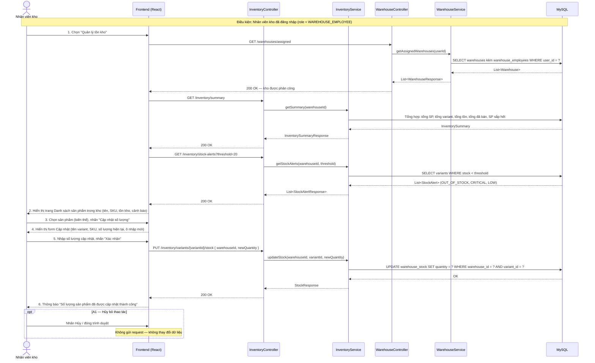
```mermaid
sequenceDiagram
    actor NV as Nhân viên kho
    participant FE as Frontend (React)
    participant IC as InventoryController
    participant IS as InventoryService
    participant WC as WarehouseController
    participant WS as WarehouseService
    participant DB as MySQL

    Note over NV,DB: Điều kiện: Nhân viên kho đã đăng nhập (role = WAREHOUSE_EMPLOYEE)

    NV->>FE: 1. Chọn "Quản lý tồn kho"
    FE->>WC: GET /warehouses/assigned
    WC->>WS: getAssignedWarehouses(userId)
    WS->>DB: SELECT warehouses kèm warehouse_employees WHERE user_id = ?
    DB-->>WS: List<Warehouse>
    WS-->>WC: List<WarehouseResponse>
    WC-->>FE: 200 OK — kho được phân công

    FE->>IC: GET /inventory/summary
    IC->>IS: getSummary(warehouseId)
    IS->>DB: Tổng hợp: tổng SP, tổng variant, tổng tồn, tổng đã bán, SP sắp hết
    DB-->>IS: InventorySummary
    IS-->>IC: InventorySummaryResponse
    IC-->>FE: 200 OK

    FE->>IC: GET /inventory/stock-alerts?threshold=20
    IC->>IS: getStockAlerts(warehouseId, threshold)
    IS->>DB: SELECT variants WHERE stock < threshold
    DB-->>IS: List<StockAlert> (OUT_OF_STOCK, CRITICAL, LOW)
    IS-->>IC: List<StockAlertResponse>
    IC-->>FE: 200 OK

    FE-->>NV: 2. Hiển thị trang Danh sách sản phẩm trong kho (tên, SKU, tồn kho, cảnh báo)

    NV->>FE: 3. Chọn sản phẩm (biến thể), nhấn "Cập nhật số lượng"
    FE-->>NV: 4. Hiển thị form Cập nhật (tên variant, SKU, số lượng hiện tại, ô nhập mới)

    NV->>FE: 5. Nhập số lượng cập nhật, nhấn "Xác nhận"
    FE->>IC: PUT /inventory/variants/{variantId}/stock { warehouseId, newQuantity }
    IC->>IS: updateStock(warehouseId, variantId, newQuantity)
    IS->>DB: UPDATE warehouse_stock SET quantity = ? WHERE warehouse_id = ? AND variant_id = ?
    DB-->>IS: OK
    IS-->>IC: StockResponse
    IC-->>FE: 200 OK
    FE-->>NV: 6. Thông báo "Số lượng sản phẩm đã được cập nhật thành công"

    opt A1 — Hủy bỏ thao tác
        NV->>FE: Nhấn Hủy / đóng trình duyệt
        Note over FE: Không gửi request — không thay đổi dữ liệu
    end
```

---

## Đặc tả Use Case Chi Tiết (Text)

### UC01 — Tìm kiếm sản phẩm
- Tác nhân chính: Người xem
- Mục tiêu: Tìm sản phẩm theo từ khóa, danh mục, khoảng giá, sắp xếp.
- Tiền điều kiện: Hệ thống hoạt động, dữ liệu sản phẩm đã được đồng bộ.
- Hậu điều kiện: Danh sách sản phẩm phù hợp được hiển thị hoặc thông báo không tìm thấy.
- Luồng chính:
1. Người xem nhập từ khóa và bộ lọc.
2. Frontend gọi endpoint tìm kiếm.
3. Hệ thống truy vấn Elasticsearch, fallback DB nếu cần.
4. Trả danh sách kết quả.
5. Người xem chọn sản phẩm để xem chi tiết.
- Luồng thay thế:
1. Không có kết quả: hiển thị thông báo không tìm thấy.
2. Người dùng hủy thao tác: không thay đổi dữ liệu.

### UC02 — Quản lý giỏ hàng
- Tác nhân chính: Người xem
- Mục tiêu: Thêm, sửa, xóa sản phẩm trong giỏ hàng.
- Tiền điều kiện: Sản phẩm/biến thể tồn tại và còn hàng.
- Hậu điều kiện: Giỏ hàng phản ánh đúng số lượng người dùng thao tác.
- Luồng chính:
1. Chọn biến thể và số lượng.
2. Thêm vào giỏ hàng.
3. Mở trang giỏ hàng để xem danh sách.
4. Có thể cập nhật số lượng hoặc xóa dòng hàng.
- Luồng thay thế:
1. Số lượng vượt tồn kho: trả lỗi, không thêm.
2. Người dùng hủy thao tác: không thay đổi dữ liệu.

### UC03 — Đăng ký tài khoản
- Tác nhân chính: Khách hàng
- Mục tiêu: Tạo tài khoản mới để sử dụng hệ thống.
- Tiền điều kiện: Hệ thống hoạt động, email/username chưa tồn tại.
- Hậu điều kiện: Tài khoản mới được tạo thành công.
- Luồng chính:
1. Mở form đăng ký.
2. Nhập thông tin bắt buộc.
3. Hệ thống kiểm tra hợp lệ và mã hóa mật khẩu.
4. Lưu tài khoản mới vào DB.
5. Thông báo đăng ký thành công.
- Luồng thay thế:
1. Dữ liệu không hợp lệ hoặc trùng email: trả lỗi chi tiết.
2. Người dùng hủy thao tác: không thay đổi dữ liệu.

### UC04 — Quản lý thông tin cá nhân
- Tác nhân chính: Khách hàng
- Mục tiêu: Cập nhật hồ sơ cá nhân và địa chỉ giao hàng.
- Tiền điều kiện: Khách hàng đã đăng nhập hợp lệ.
- Hậu điều kiện: Hồ sơ/địa chỉ được cập nhật đúng dữ liệu mới.
- Luồng chính:
1. Mở trang thông tin cá nhân.
2. Chỉnh sửa thông tin (họ tên, SĐT, avatar...).
3. Gửi yêu cầu cập nhật.
4. Hệ thống lưu thay đổi và trả về dữ liệu mới.
5. Quản lý địa chỉ (thêm/sửa/xóa/đặt mặc định).
- Luồng thay thế:
1. Dữ liệu không hợp lệ: báo lỗi.
2. Người dùng hủy thao tác: không thay đổi dữ liệu.

### UC05 — Đặt hàng
- Tác nhân chính: Khách hàng
- Mục tiêu: Tạo đơn hàng từ giỏ, chọn địa chỉ, thanh toán.
- Tiền điều kiện: Đã đăng nhập, giỏ hàng có sản phẩm hợp lệ.
- Hậu điều kiện: Đơn hàng được tạo (và thanh toán thành công nếu online).
- Luồng chính:
1. Chọn sản phẩm từ giỏ để checkout.
2. Tính phí vận chuyển.
3. Chọn địa chỉ, voucher, phương thức thanh toán.
4. Gửi yêu cầu tạo đơn.
5. Hệ thống kiểm tra tồn kho, áp mã giảm giá, chọn kho xử lý.
6. Tạo đơn hàng và order item.
7. Nếu online thì tạo URL thanh toán và xử lý callback.
- Luồng thay thế:
1. Hết hàng trong lúc checkout: hủy tạo đơn, báo lỗi.
2. Thanh toán thất bại: đổi trạng thái đơn, hoàn tồn kho khi cần.
3. Người dùng hủy thao tác: không thay đổi dữ liệu.

### UC06 — Đánh giá sản phẩm
- Tác nhân chính: Khách hàng
- Mục tiêu: Đánh giá sản phẩm đã mua/đã nhận.
- Tiền điều kiện: Đăng nhập, có order item đủ điều kiện review.
- Hậu điều kiện: Đánh giá được lưu và cập nhật thống kê rating sản phẩm.
- Luồng chính:
1. Mở danh sách đơn hàng.
2. Chọn đơn đã giao thành công.
3. Nhập số sao và nhận xét.
4. Gửi đánh giá.
5. Hệ thống kiểm tra quyền và trạng thái đơn.
6. Lưu review và cập nhật điểm trung bình.
- Luồng thay thế:
1. Đã đánh giá trước đó hoặc không đủ điều kiện: trả lỗi.
2. Người dùng hủy thao tác: không thay đổi dữ liệu.

### UC07 — Nhắn tin
- Tác nhân chính: Khách hàng
- Mục tiêu: Chat realtime với shop.
- Tiền điều kiện: Đăng nhập, có quyền chat với shop.
- Hậu điều kiện: Tin nhắn được lưu và đồng bộ realtime giữa hai bên.
- Luồng chính:
1. Tạo/lấy room chat riêng.
2. Tải lịch sử tin nhắn.
3. Kết nối WebSocket, subscribe room.
4. Gửi tin nhắn text hoặc ảnh.
5. Server lưu DB và broadcast realtime.
6. Đánh dấu đã đọc khi mở phòng chat.
- Luồng thay thế:
1. Mất kết nối WS: có thể fallback tải lại lịch sử.
2. Người dùng đóng chat: ngắt kết nối WS, dữ liệu vẫn giữ nguyên.

### UC08 — Quản lý shop (Admin)
- Tác nhân chính: Quản trị viên
- Mục tiêu: Duyệt, từ chối, đình chỉ shop.
- Tiền điều kiện: Admin đăng nhập, có quyền quản trị.
- Hậu điều kiện: Trạng thái shop thay đổi đúng nghiệp vụ, có thông báo cho chủ shop.
- Luồng chính:
1. Xem danh sách shop theo trạng thái.
2. Tìm kiếm shop theo tên.
3. Mở chi tiết shop cần xử lý.
4. Thực hiện duyệt shop.
5. Hệ thống cập nhật trạng thái và gửi notification.
- Luồng thay thế:
1. Không tìm thấy shop: trả danh sách rỗng.
2. Đình chỉ/từ chối: cập nhật trạng thái tương ứng và gửi lý do.

### UC09 — Quản lý người dùng (Admin)
- Tác nhân chính: Quản trị viên
- Mục tiêu: Xem danh sách, khóa/mở khóa tài khoản.
- Tiền điều kiện: Admin đăng nhập.
- Hậu điều kiện: Trạng thái active của tài khoản được cập nhật đúng.
- Luồng chính:
1. Mở trang quản lý người dùng.
2. Tìm kiếm theo tên/email.
3. Mở chi tiết tài khoản.
4. Thực hiện khóa hoặc mở khóa.
5. Hệ thống cập nhật dữ liệu và trả kết quả.
- Luồng thay thế:
1. Không tìm thấy người dùng: thông báo dữ liệu rỗng.
2. Người dùng hủy thao tác: không thay đổi dữ liệu.

### UC10 — Quản lý danh mục sản phẩm (Admin)
- Tác nhân chính: Quản trị viên
- Mục tiêu: Tạo, sửa, xóa danh mục sản phẩm.
- Tiền điều kiện: Admin đăng nhập và có quyền quản trị danh mục.
- Hậu điều kiện: Danh mục được cập nhật đúng theo thao tác.
- Luồng chính:
1. Xem danh sách danh mục.
2. Tạo danh mục mới.
3. Cập nhật danh mục hiện có.
4. Xóa danh mục khi cần.
- Luồng thay thế:
1. Tên danh mục trùng/không hợp lệ: trả lỗi.
2. Người dùng hủy thao tác: không thay đổi dữ liệu.

### UC11 — Đăng ký shop
- Tác nhân chính: Người bán
- Mục tiêu: Gửi yêu cầu mở shop.
- Tiền điều kiện: Seller đăng nhập, chưa có shop.
- Hậu điều kiện: Shop mới ở trạng thái PENDING, chờ duyệt.
- Luồng chính:
1. Mở form đăng ký shop.
2. Nhập thông tin shop và logo.
3. Gửi yêu cầu tạo shop.
4. Hệ thống tạo shop trạng thái chờ duyệt.
5. Trả thông báo thành công.
- Luồng thay thế:
1. Dữ liệu không hợp lệ hoặc user đã có shop: trả lỗi.
2. Người dùng hủy thao tác: không thay đổi dữ liệu.

### UC12 — Quản lý thông tin shop
- Tác nhân chính: Người bán
- Mục tiêu: Cập nhật hồ sơ shop (tên, mô tả, logo...).
- Tiền điều kiện: Seller đăng nhập và shop đã tồn tại.
- Hậu điều kiện: Thông tin shop được cập nhật thành công.
- Luồng chính:
1. Mở trang thông tin shop.
2. Chỉnh sửa thông tin và upload logo (nếu có).
3. Gửi cập nhật.
4. Hệ thống lưu thay đổi và phản hồi dữ liệu mới.
- Luồng thay thế:
1. Dữ liệu không hợp lệ: trả lỗi.
2. Người dùng hủy thao tác: không thay đổi dữ liệu.

### UC13 — Quản lý sản phẩm
- Tác nhân chính: Người bán
- Mục tiêu: Tạo, sửa, xóa sản phẩm/biến thể/ảnh.
- Tiền điều kiện: Seller đăng nhập, shop đã được duyệt.
- Hậu điều kiện: Dữ liệu sản phẩm và chỉ mục tìm kiếm được đồng bộ.
- Luồng chính:
1. Xem danh sách sản phẩm của shop.
2. Tạo sản phẩm mới với biến thể và ảnh.
3. Cập nhật sản phẩm hiện có.
4. Xóa mềm sản phẩm.
5. Đồng bộ index tìm kiếm.
- Luồng thay thế:
1. Dữ liệu không hợp lệ (giá âm, thiếu variant...): trả lỗi.
2. Người dùng hủy thao tác: không thay đổi dữ liệu.

### UC14 — Quản lý đơn hàng (Seller)
- Tác nhân chính: Người bán
- Mục tiêu: Xác nhận và xử lý đơn hàng của shop.
- Tiền điều kiện: Seller đăng nhập, có đơn ở các trạng thái xử lý.
- Hậu điều kiện: Đơn hàng chuyển trạng thái đúng và người mua nhận thông báo.
- Luồng chính:
1. Xem danh sách đơn theo trạng thái.
2. Mở chi tiết đơn hàng.
3. Chọn kho xử lý và xác nhận đơn.
4. Cập nhật sang SHIPPING khi giao.
5. Gửi thông báo trạng thái cho khách hàng.
- Luồng thay thế:
1. Hủy đơn (có lý do): cập nhật trạng thái CANCELLED, hoàn tồn khi cần.
2. Người dùng hủy thao tác: không thay đổi dữ liệu.

### UC15 — Quản lý mã giảm giá
- Tác nhân chính: Người bán
- Mục tiêu: Tạo, vô hiệu hóa, xóa voucher.
- Tiền điều kiện: Seller đăng nhập, shop đã hoạt động.
- Hậu điều kiện: Voucher được lưu/cập nhật/xóa đúng nghiệp vụ.
- Luồng chính:
1. Xem danh sách voucher của shop.
2. Tạo voucher mới (mã, loại, giá trị, thời hạn).
3. Vô hiệu hóa voucher khi cần.
4. Xóa voucher khi không dùng.
- Luồng thay thế:
1. Mã trùng hoặc cấu hình không hợp lệ: trả lỗi.
2. Người dùng hủy thao tác: không thay đổi dữ liệu.

### UC16 — Quản lý nhân viên kho
- Tác nhân chính: Người bán
- Mục tiêu: Tạo tài khoản nhân viên kho, phân công/gỡ khỏi kho.
- Tiền điều kiện: Seller đăng nhập, có kho hàng.
- Hậu điều kiện: Quan hệ nhân viên-kho được cập nhật chính xác.
- Luồng chính:
1. Xem danh sách nhân viên theo kho.
2. Tạo tài khoản nhân viên mới.
3. Gán nhân viên vào kho.
4. Gỡ nhân viên khỏi kho.
- Luồng thay thế:
1. Username/email không hợp lệ hoặc trùng: trả lỗi.
2. Người dùng hủy thao tác: không thay đổi dữ liệu.

### UC17 — Quản lý tồn kho
- Tác nhân chính: Nhân viên kho
- Mục tiêu: Theo dõi và cập nhật tồn kho theo biến thể.
- Tiền điều kiện: Nhân viên kho đăng nhập và được phân công kho.
- Hậu điều kiện: Số lượng tồn kho mới được lưu thành công.
- Luồng chính:
1. Xem kho được phân công.
2. Xem dashboard tồn kho và cảnh báo thiếu hàng.
3. Chọn biến thể cần chỉnh tồn.
4. Cập nhật số lượng mới.
5. Hệ thống lưu thay đổi và trả kết quả.
- Luồng thay thế:
1. Dữ liệu cập nhật không hợp lệ: trả lỗi.
2. Người dùng hủy thao tác: không thay đổi dữ liệu.

### UC18 — Quản lý đơn hàng theo kho
- Tác nhân chính: Nhân viên kho
- Mục tiêu: Đóng gói, xác nhận xuất kho, cập nhật trạng thái giao hàng.
- Tiền điều kiện: Nhân viên kho đăng nhập, có đơn được gán cho kho.
- Hậu điều kiện: Đơn chuyển trạng thái PACKED/SHIPPING, khách nhận thông báo.
- Luồng chính:
1. Xem danh sách đơn của kho.
2. Mở chi tiết đơn cần xử lý.
3. Thực hiện đóng gói (`pack`).
4. Thực hiện xuất giao (`ship`).
5. Hệ thống cập nhật trạng thái và gửi notification.
- Luồng thay thế:
1. Dữ liệu đơn không hợp lệ/trạng thái không cho phép: trả lỗi.
2. Người dùng hủy thao tác: không thay đổi dữ liệu.

---

## UC18 — Quản lý đơn hàng theo kho

**Tác nhân:** Nhân viên kho &nbsp;|&nbsp; **Mô tả:** Xem danh sách đơn được gán cho kho, đóng gói, tạo vận đơn và cập nhật trạng thái giao hàng.

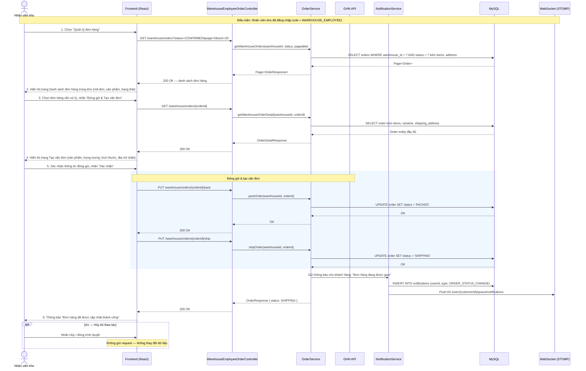
```mermaid
sequenceDiagram
    actor NV as Nhân viên kho
    participant FE as Frontend (React)
    participant WOC as WarehouseEmployeeOrderController
    participant OS as OrderService
    participant GHN as GHN API
    participant NS as NotificationService
    participant DB as MySQL
    participant WS as WebSocket (STOMP)

    Note over NV,WS: Điều kiện: Nhân viên kho đã đăng nhập (role = WAREHOUSE_EMPLOYEE)

    NV->>FE: 1. Chọn "Quản lý đơn hàng"
    FE->>WOC: GET /warehouse/orders?status=CONFIRMED&page=0&size=20
    WOC->>OS: getWarehouseOrders(warehouseId, status, pageable)
    OS->>DB: SELECT orders WHERE warehouse_id = ? AND status = ? kèm items, address
    DB-->>OS: Page<Order>
    OS-->>WOC: Page<OrderResponse>
    WOC-->>FE: 200 OK — danh sách đơn hàng
    FE-->>NV: 2. Hiển thị trang Danh sách đơn hàng trong kho (mã đơn, sản phẩm, trạng thái)

    NV->>FE: 3. Chọn đơn hàng cần xử lý, nhấn "Đóng gói & Tạo vận đơn"
    FE->>WOC: GET /warehouse/orders/{orderId}
    WOC->>OS: getWarehouseOrderDetail(warehouseId, orderId)
    OS->>DB: SELECT order kèm items, variants, shipping_address
    DB-->>OS: Order entity đầy đủ
    OS-->>WOC: OrderDetailResponse
    WOC-->>FE: 200 OK
    FE-->>NV: 4. Hiển thị trang Tạo vận đơn (sản phẩm, trọng lượng, kích thước, địa chỉ nhận)

    NV->>FE: 5. Xác nhận thông tin đóng gói, nhấn "Xác nhận"

    rect rgb(240, 248, 255)
        Note over FE,GHN: Đóng gói & tạo vận đơn
        FE->>WOC: PUT /warehouse/orders/{orderId}/pack
        WOC->>OS: packOrder(warehouseId, orderId)
        OS->>DB: UPDATE order SET status = 'PACKED'
        DB-->>OS: OK
        OS-->>WOC: OK
        WOC-->>FE: 200 OK

        FE->>WOC: PUT /warehouse/orders/{orderId}/ship
        WOC->>OS: shipOrder(warehouseId, orderId)
        OS->>DB: UPDATE order SET status = 'SHIPPING'
        DB-->>OS: OK
    end

    OS->>NS: Gửi thông báo cho khách hàng: "Đơn hàng đang được giao"
    NS->>DB: INSERT INTO notifications (userId, type: ORDER_STATUS_CHANGE)
    NS->>WS: Push tới /user/{customerId}/queue/notifications

    OS-->>WOC: OrderResponse { status: SHIPPING }
    WOC-->>FE: 200 OK
    FE-->>NV: 6. Thông báo "Đơn hàng đã được cập nhật thành công"

    opt A1 — Hủy bỏ thao tác
        NV->>FE: Nhấn Hủy / đóng trình duyệt
        Note over FE: Không gửi request — không thay đổi dữ liệu
    end
```
